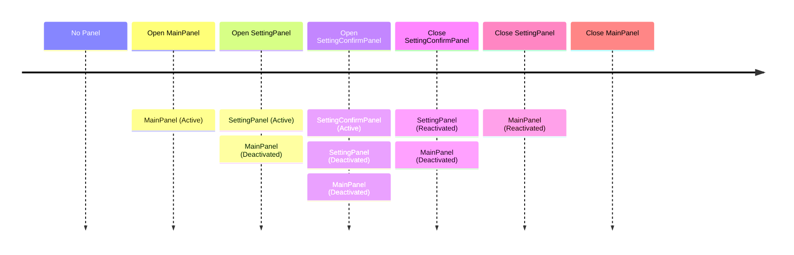
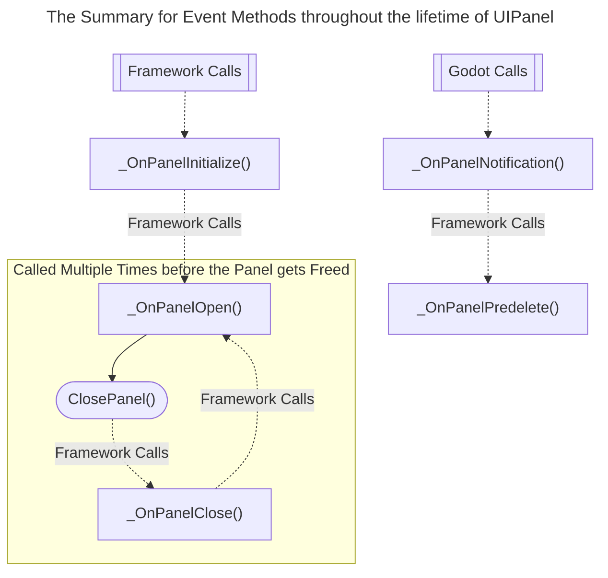

# GD Panel Framework [Work In Progress]

[](https://github.com/Delsin-Yu/GDPanelFramework/releases/Latest) [](https://www.nuget.org/packages/GDPanelFramework)  [](https://github.com/Delsin-Yu/GDPanelFramework/stargazers) [](https://github.com/Delsin-Yu/GDPanelFramework/blob/main/LICENSE)

## Introduction

Supports in `Godot 4.1+` with .Net module.
***GD Panel Framework*** is a `Godot 4` UI Management System designed to provide a `flexible`, `panel-based`, `single-focus point`, `Gamepad + Keyboard + Keyboard&Mouse friendly` UI programming experience.

This framework groups `sets` of `user interactions` into a `UIPanel`, which includes a combination of the following:

1. `Controls`, such as `button`, `label`, and `container`.
2. `Inputs`, which is a set of developer-defined input actions binds with this panel.

These `user interactions` are `panel-scoped`, which means they only stay active when the `panel` is active; this simplifies the workflow for maintaining large amounts of discrete `Controls` and `Global Input Actions` and allows developers to focus on programming game logic (*not collecting and toggling `Controls` or adding more `if`s into a global `_Input` method*).

---

<!-- START doctoc generated TOC please keep comment here to allow auto update -->
<!-- DON'T EDIT THIS SECTION, INSTEAD RE-RUN doctoc TO UPDATE -->
## Table of Contents

- [Simple API Usage](#simple-api-usage)
  - [Creating a simple panel](#creating-a-simple-panel)
  - [Creating a panel with Argument](#creating-a-panel-with-argument)
- [Framework Documentation](#framework-documentation)
  - [Framework Concept](#framework-concept)
  - [The `UIPanel`](#the-uipanel)
    - [Instantiate a Panel](#instantiate-a-panel)
    - [Open a panel](#open-a-panel)
    - [Close a panel](#close-a-panel)
    - [Input Binding / Routing](#input-binding--routing)
    - [Panel Stack](#panel-stack)
    - [Framework-level Caching](#framework-level-caching)
    - [Panel Event Methods Overview](#panel-event-methods-overview)
    - [Configuring the Previous Panel Visual Behavior](#configuring-the-previous-panel-visual-behavior)
  - [The `UIPanelArg`](#the-uipanelarg)
  - [Panel Container Management](#panel-container-management)
  - [Panel Tweener](#panel-tweener)
  - [AsyncInterop Class](#asyncinterop-class)
  - [Please Note when using this Framework](#please-note-when-using-this-framework)

<!-- END doctoc generated TOC please keep comment here to allow auto update -->

---

## Simple API Usage

### Creating a simple panel

You can run ***[RunMe_Example00.tscn](https://github.com/Delsin-Yu/GDPanelFramework.Test/blob/main/Examples/00/RunMe_Example00.tscn)*** in Godot Editor.

```csharp
using GDPanelFramework;
using Godot;
using GodotTask;

/// <summary>
/// The bootstrap script that creates and opens the panel.
/// </summary>
public partial class Example00_Main : Node
{
    /// <summary>
    /// The packed panel.
    /// </summary>
    [Export] private PackedScene _panelPrefab;

    /// <summary>
    /// Executes the main logic after one frame since the game starts. 
    /// This is required by the GDPanelFramework for adding its panel root into the scene tree.
    /// </summary>
    public override void _Ready() =>
        GDTask.NextFrame().ContinueWith(OnReady);

    private void OnReady()
    {
        _panelPrefab
            .CreatePanel<Example00_MyPanel>() // This extension method tells the framework to create or reuse an instance of this panel.
            .OpenPanel( // This method tells the framework to opens the panel.
                onPanelCloseCallback: // This delegate gets called when this panel gets closed when the panel itself calls ClosePanel().
                () => GetTree().Quit() // Terminate the application when this panel gets closed.
            );
    }
}
```

```csharp
// Main.cs
using GDPanelFramework.Panels;
using Godot;

/// <summary>
/// Attach this script to a Control to make it a "UIPanel".
/// </summary>
public partial class Example00_MyPanel : UIPanel
{
    // These three fields are assigned in Godot Editor, through inspector.
    [Export] private Label _text;
    [Export] private Button _updateButton;
    [Export] private Button _closeButton;

    // Stores the click count.
    private int _clickCount = 0;

    /// <summary>
    /// Called by the framework when this instance of panel is created,
    /// an instance can only gets created once.
    /// </summary>
    protected override void _OnPanelInitialize()
    {
        _updateButton.Pressed += OnClick; // Calls OnClick then the _updateButton gets pressed.
        _closeButton.Pressed += ClosePanel; // Close this panel when the _closeButton gets pressed.
    }

    /// <summary>
    /// Registered to the <see cref="_updateButton"/>.
    /// </summary>
    private void OnClick()
    {
        _clickCount++;
        _text.Text = $"Clicked {_clickCount} time(s).";
    }

    /// <summary>
    /// Called by the framework when this instance of panel is opened. 
    /// The framework supports automatic panel caching
    /// so a panel may gets opened multiple times after it's closed.
    /// </summary>
    protected override void _OnPanelOpen()
    {
        _text.Text = "Hello World";
        _updateButton.GrabFocus();
    }
}
```

### Creating a panel with Argument

> TODO

## Framework Documentation

### Framework Concept

In a typical GUI application such as Games, a `panel/page-based control flow` is a common practice.

When opening a panel from the `main logic`, developer may want the panel executes its own `panel logic` and `self closes` when finish, then continue the `main logic` (such as file dialog or warning).

This design `transfers the control flow from the main logic to the panel, and the panel returns the control flow back to the main logic when finish` simplifies the workflow for programming panels, it handles the requirement for managing ui focuses, and is crucial when designing game pad compatible games.

This framework implementing this practice by the `Panel Stack based Control Management`, `Async/Callback Styled API`, and `Panel Input Binding` design.

### The `UIPanel`

`UIPanel` is the fundamental component of the framework, it provides `Panel Level Input Binding`, `Child Control Access Management` features for simplfying programming workflow, it also supports configurable `Panel Tweener` for animated opening/closing requirements.

- The `Panel Level Input Binding` feature allows developers to register/deregister a set of input bindings for this panel, the registered inputs are sandboxed at the panel level so they don't get in the way when panel is inactive.

- The `Child Control Access Management` feature automatically disables/restores the `FocusMode` and `MouseFilter` property for every child control when the panel activates/deactivates, this prevents unwanted UI Navigation and Mouse Interaction to `leaked behind` the current activated panel.

#### Instantiate a Panel

Call `CreatePanel<TPanel>` to instatiate a panel from the supplied PackedScene, instead of the built-in `PackedScene.Instantiate`, this API also handles necessary initialization and caching.

```csharp
// In caller class.
[Export] private PackedScene _panelPrefab;

// In caller method.
var panelInstance = 
        _panelPrefab
            .CreatePanel<TypeOfScriptAttachedToThePanel>();
```

#### Open a panel

There are three OpenPanel Methods for a UIPanel each of which is designed for a certain programming style.

In an async method, a `async/await-styled` opening method returns a `one-time awaitable` that allows the developer to `await` for a panel close, in `PanelArg`, awaiting this awaitable will also get the return value from the panel.

```csharp
// When opening a panel, in async method.
await panelInstance.OpenPanelAsync();
GD.Print("The panel has closed!");
```

A `callback-styled` opening method allows the developer to supply a delegate to get notified when the panel has closed, in `PanelArg`, the return value will also pass to this delegate.

```csharp
// When opening a panel.
panelInstance
    .OpenPanel(
        onPanelCloseCallback: // This lambda gets called when the panel is closed.
           () => GD.Print("The panel has closed!")
    );
```

A `forget-styled` opening method only opens the panel, it is useful when the time of a panel closing is not a concern.

```csharp
// When opening a panel.
panelInstance.OpenPanel();
```

#### Close a panel

Calling `ClosePanel()` in a panel script will close the opened panel. This method is `protected` by default, developer may expose this method by wrapping it around by a public one.

Note that a panel must be opened before you can close it; and closing a panel that's not on top of the panel stack is considered an error and will crash the framework.

```csharp
// Inside a panel script
protected override void _OnPanelOpen()
{
    // Close a panel one frame after it openes.
    GDTask.NextFrame().ContinueWith(ClosePanel);
}
```

#### Input Binding / Routing

All Godot Input Events are intercepted by the `root/RootPanelViewport` and dispatches directly to the active panel. This simplifies the input management process by 

> WIP: Introduction to the framework level Input Routing  
> WIP: The `RegisterInput` Method  
> WIP: The `RemoveInput` Method  
> WIP: The `GodotBuiltinActionNames` Static Class  
> WIP: The `PanelManager.UICancelActionName` Property  
> WIP: The `RegisterCancelInput` Method  
> WIP: The `RemoveCancelInput` Method  
> WIP: The `EnableCloseWithCancelKey` Method  
> WIP: The `DisableCloseWithCancelKey` Method  

#### Panel Stack

The `Panel Stack` is designed for maintaining the order of the opened panels, when opening a panel, the framework peeks at the panel stack for the top panel, disable every control under it (their opening statuses are cached), and push this new instance to the stack. When closing the top panel, the framework pops it from the panel stack and reactivates all the control for the panel underneath it, it also set the focus to the last selected item before this panel becomes inactive.

The example below shows the panel stack of the following sequence of operations:



#### Framework-level Caching

In certain cases where a panel requires `frequent opening and closing by design` *(think about the inventory panel in some games)*, instantiating a panel everytime and delete it on close can be expensive. To resolve this performance issue, the framework does `automatically panel caching` that you can `configure on a per opening/closing basis`.

When creating a panel, by specifying the `createPolicy`, you may choose to force the framework `instantiate` a new instance of the panel (`CreatePolicy.ForceCreate`) or let the framework `reuse a cached instance (default)` if possible (`CreatePolicy.TryReuse`), of course, if there is no existing cache, a new instance is created anyway.

```csharp
// When creating a panel.
var panelInstance = 
        _panelPrefab
            .CreatePanel<TPanel>(
                createPolicy: CreatePolicy.ForceCreate // CreatePolicy.TryReuse
            );
```

When opening a panel, by specifying the `closePolicy`, you may choose to instruct the framework to `delete this instance` (`ClosePolicy.Delete`) after the transition completes or let the framework to `cache this instance (default)` (`ClosePolicy.Cache`), which you can reuse when the calling `CreatePanel` on the same `PackedScene` next time.

```csharp
// When opening a panel.
panelInstance
    .OpenPanel(
        closePolicy: ClosePolicy.Delete // ClosePolicy.Cache
    );

```

#### Panel Event Methods Overview

While working with `UIPanel`s, certain methods get called at a certain lifetime of a panel, a brief diagram of the panel can be summarised as follows.



1. When calling `CreatePanel<TPanel>(PackedScene)` and causing a new instance of the creation, after the framework has done basic initializing, the `_OnPanelInitialize` method of that instance gets invoked. This method gets called only once throughout the panel lifetime; that means, if the `CreatePanel` has reused an instance of the panel, this method is not invoked again.
2. When calling any of the `OpenPanel` on a non-opened panel instance, after the framework has done preparations for opening this panel, the `_OnPanelOpen` method gets invoked. For a closed panel that gets cached, `_OnPanelOpen` will get re-invoked when the panel gets reopened.
3. When calling the `ClosePanel`, after the framework has done preparations for closing this panel, the `_OnPanelClose` method gets invoked. For a panel that gets cached, `_OnPanelClose` will get re-invoked when the panel gets reopened and closed.
4. A `UIPanel` delegates the `_Notification` engine call to `_OnPanelNotification`, and calls `_OnPanelPredelete` when necessary.

#### Configuring the Previous Panel Visual Behavior

When opening a new panel, the currently active panel becomes `unavailable (such as buttons will no longer be clickable or focusable)`, you may also control whether the current panel should stay visible or hidden.

Setting the `previousPanelVisual` to `PreviousPanelVisual.Hidden` in `OpenPanel`, will instruct the framework to `hide the previous panel` using its `PanelTweener`, otherwise the panel will `stays visible (default)` (`PreviousPanelVisual.Visible`).

```csharp
// When opening a panel.
panelInstance
    .OpenPanel( // Any panel opening method.
        previousPanelVisual: PreviousPanelVisual.Hidden // PreviousPanelVisual.Visible
    );
```

### The `UIPanelArg`

precautionsIt is a common practice for passing the argument to/receiving return value from a panel, `UIPanelArg<TOpenArg, TCloseArg>` is here to achieve this requirement.

```csharp
// MyArgumentPanel.cs
// Defines a panel that accepts an int as the opening argument, and string as the returning value.
public partial class MyArgumentPanel : UIPanelArg<int, string>
{
    protected override void _OnPanelOpen(int openArg) // The opening argument passed from the caller.
    {
        GD.Print($"Opened with argument: {openArg}");
        ClosePanel(openArg.ToString()); // The ClosePanel method requires a return value.
    }
}
```

Different from the regular `UIPanel` type, the `OpenPanel` methods of a `UIPanelArg` accepts an extra argument and passes it to the `_OnPanelOpen(TOpenArg)` panel event method and its async/callback-styled overload has its way for obtaining the return value.

```csharp
// In caller class.
[Export] private PackedScene _panelPrefab;

// In caller method.
var argPanelInstance = _panelPrefab.CreatePanel<MyArgumentPanel>();

// Async/Await-styled open method.
string returnValue = await argPanelInstance.OpenPanelAsync(10); // return value is "10".

// Callback/Delegate-styled open method.
argPanelInstance.OpenPanel(10, onPanelCloseCallback: value => GD.Print(value == "10")) // prints true when the panel closes.
```

The `UIPanelArg` supports both `passing an argument` and `returning a value`, if one of the features is not needed, you may use the `Empty` struct to serve as a placeholder.

```csharp
// The definition for a panel that does't requires opening argument.
public partial class MyArgumentPanel : UIPanelArg<Empty, string>
{
    protected override void _OnPanelOpen(Empty _)
    {
        ClosePanel("Hello World!");
    }
}

// In caller method
argPanelInstance.OpenPanelAsync(Empty.Default);
```

```csharp
// The definition for a panel that doesn't requires returning value.
public partial class MyArgumentPanel : UIPanelArg<int, Empty>
{
    protected override void _OnPanelOpen(int openArg)
    {
        GD.Print($"Opened with argument: {openArg}");
        ClosePanel(Empty.Default);
    }
}
```

### Panel Container Management

All panels in are instantiated under `root/RootPanelViewport/PanelRoot` by default, developers may configure the container for the opening panel through a series of APIs.

Similar to the `Panel Stack`, `Panel Container Stack` is design for managing the `panel container`s, developer may use push a control to the panel container stack using `PanelManager.PushPanelContainer`, and pop the topmost container by `PanelManager.PopPanelContainer`. Same as the restrictions of opening and closing panel, developers are only allowed to pop the topmost container before they are allowed to pop the other containers.

To preventing unexpected poping of containers, each `PushPanelContainer` operation is `authorised` by a Node, that is, you need to provide a `key` when pushing a new container, and popping the container with the same `key`.

```csharp
// In class
[Export] private Control _myContainer;

// In method

// Every opened panel after this line will get instantiating/reparenting under _myContainer.
PanelManager.PushPanelContainer(this, _myContainer);

// Every opened panel after this line will get instantiating/reparenting under the default panel container.
PanelManager.PopPanelContainer(this);
```

> Please note that, when working with customized panel containers, be careful when `spawning panels under a panel/custom container` that's `getting deleted in the future`, while the framework is trying its best to handle deleted panels, it is possible to `delete custom panel containers that have active panels lives under`, such behavior will possibly crash the framework, developers are recommended to e`nsure every panel under a custom container has closed` before `poping/deleting that container`.

### Panel Tweener

> WIP: Introduction to the `PanelTweener` and `IPanelTweener` interface  
> WIP: The `PanelManager.IPanelTweener` Property  
> WIP: The `IPanelTweener` Property in Panel  
> WIP: The Built-in `NonePanelTweener`  
> WIP: The Built-in `FadePanelTweener`  

### AsyncInterop Class

> WIP: Introduction to converting a `delegate/callback` style api into `async/await` style api  

### Please Note when using this Framework

While there are precautions taken in order to prevent framework crashes, there are still certain

The following panel event methods are execute in under `try ... catch bloack`, throwing exceptions in the overrides of these methods will not crash the framework.

- `_OnPanelInitialize`
- `_OnPanelOpen`
- `_OnPanelClose`
- `_OnPanelPredelete`
- `_OnPanelNotification`
- Registered input events

The following usage ***WILL*** crash the framework:

- Openning a panel that's not initialized, which probably means the instance of this panel is not obtained through `CreatePanel` API.
- Openning a panel that's already opened.
- Closing a panel that's not the last opened panel.
