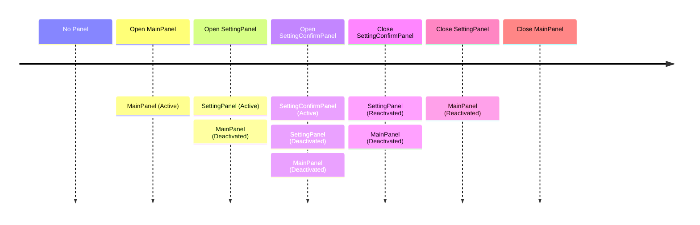
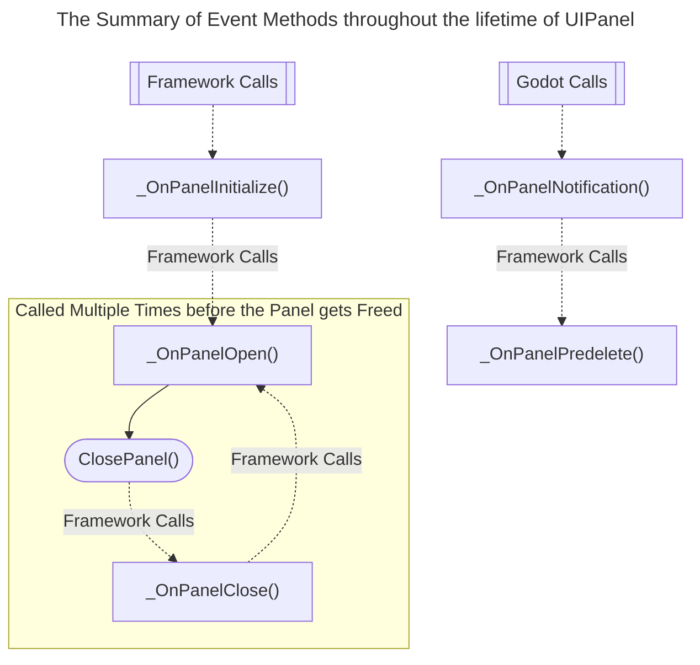

# GD Panel Framework

[中文](https://github.com/Delsin-Yu/GDPanelFramework/blob/main/README_CN.md)

[](https://github.com/Delsin-Yu/GDPanelFramework/releases/latest) [](https://github.com/Delsin-Yu/GDPanelFramework/stargazers) [](https://github.com/Delsin-Yu/GDPanelFramework/blob/main/LICENSE)

## Introduction

Supports in `Godot 4.5+` with `mono (.Net)` module.
***GD Panel Framework*** is a `Godot 4` UI Management System designed to provide a `flexible`, `panel-based`, `single-focus point`, `Gamepad + Keyboard + Keyboard&Mouse friendly` UI programming experience.

This framework groups `sets` of `user interactions` into a `UIPanel`, which includes a combination of the following:

1. `Controls`, such as `button`, `label`, and `container`.
2. `Inputs`, which is a set of developer-defined input actions binds with this panel.

These `user interactions` are `panel-scoped`, which means they only stay active when the `panel` is active; this simplifies the workflow for maintaining large amounts of discrete `Controls` and `Global Input Actions` and allows developers to focus on programming game logic (*not collecting and toggling `Controls` or adding more `if`s into a global `_Input` method*).

## Installation

As the Godot doesn't work well with external assemblies, the `GD Panel Framework` is now distributed by `zip/addon` instead of being a Nuget Package.

1. Ensure your project C# language version is at least `<LangVersion>12</LangVersion>`.
2. Download the `GDPanelFramework.zip` from the latest [release](https://github.com/Delsin-Yu/GDPanelFramework/releases).
3. Decompress the file and place the `addons` directory into the project root (`res://`).
4. Call the `PanelManager.Initialize()` method before use any APIs.

This addon only contains source file for runtime use; so you do not need to enable it from the `Plugin` window.

---

<!-- START doctoc generated TOC please keep comment here to allow auto update -->
<!-- DON'T EDIT THIS SECTION, INSTEAD RE-RUN doctoc TO UPDATE -->
## Table of Contents

- [Simple API Usage](#simple-api-usage)
  - [Creating a simple panel](#creating-a-simple-panel)
  - [Creating a panel with Argument](#creating-a-panel-with-argument)
- [Framework Documentation](#framework-documentation)
  - [Framework Concept](#framework-concept)
  - [The `UIPanel`](#the-uipanel)
    - [Instantiate a Panel](#instantiate-a-panel)
    - [Open a panel](#open-a-panel)
    - [Close a panel](#close-a-panel)
    - [Input Binding / Routing](#input-binding--routing)
      - [Input Registration](#input-registration)
        - [Basic Usage](#basic-usage)
                - [Default Input Phase](#default-input-phase)
                - [Variation: `RegisterAnyKeyInput`](#variation-registeranykeyinput)
                - [Variation: `RegisterInputToggle`](#variation-registerinputtoggle)
                - [Variation: `RegisterEchoedInput`/`RemoveEchoedInput`](#variation-registerechoedinputremoveechoedinput)
        - [Variation: `RegisterInputCancel`/`RemoveInputCancel`/`ToggleInputCancel`](#variation-registerinputcancelremoveinputcanceltoggleinputcancel)
        - [Variation: `EnableCloseWithCancelKey` and `DisableCloseWithCancelKey`](#variation-enableclosewithcancelkey-and-disableclosewithcancelkey)
        - [Variation: `RegisterInputAxis`/`RemoveInputAxis`/`ToggleInputAxis`](#variation-registerinputaxisremoveinputaxistoggleinputaxis)
        - [Variation: `RegisterInputVector`/`RemoveInputVector`/`ToggleInputVector`](#variation-registerinputvectorremoveinputvectortoggleinputvector)
      - [the BuiltinInputNames Class](#the-builtininputnames-class)
            - [Global Input Listeners](#global-input-listeners)
    - [Panel Stack](#panel-stack)
    - [Framework-level Caching](#framework-level-caching)
        - [Scoped Panel Buffering](#scoped-panel-buffering)
    - [Panel Event Methods Overview](#panel-event-methods-overview)
    - [Configuring the Previous Panel Visual Behavior](#configuring-the-previous-panel-visual-behavior)
    - [The `UIPanelArg1` and `UIPanelArg2`](#the-uipanelarg1-and-uipanelarg2)
  - [Panel Container Management](#panel-container-management)
  - [The `Panel Tweener`](#the-panel-tweener)
    - [Built-in Tweeners](#built-in-tweeners)
    - [Customized Tweenrs](#customized-tweenrs)
  - [Note when using `async/await` Styled API](#note-when-using-asyncawait-styled-api)
  - [Note when using this Framework](#note-when-using-this-framework)

<!-- END doctoc generated TOC please keep comment here to allow auto update -->

---

## Simple API Usage

### Creating a simple panel

You can run ***[RunMe_Example00.tscn](https://github.com/Delsin-Yu/GDPanelFramework.Test/blob/main/Examples/00/RunMe_Example00.tscn)*** in Godot Editor.

```csharp
using Godot;
using GodotTask;

namespace GDPanelFramework.Examples;

/// <summary>
/// The bootstrap script that creates and opens the panel.
/// </summary>
public partial class Example00_Main : Node
{
    /// <summary>
    /// The packed panel.
    /// </summary>
    [Export] private PackedScene _panelPrefab;

    /// <summary>
    /// Executes the main logic after one frame since the game starts. 
    /// This is required by the GDPanelFramework for adding its panel root into the scene tree.
    /// </summary>
    public override void _Ready() =>
        GDTask.NextFrame().ContinueWith(OnReady);

    private void OnReady()
    {
        _panelPrefab
            .CreatePanel<Example00_MyPanel>() // This extension method tells the framework to create or reuse an instance of this panel.
            .OpenPanel( // This method tells the framework to opens the panel.
                onPanelCloseCallback: // This delegate gets called when this panel gets closed when the panel itself calls ClosePanel().
                () => GetTree().Quit() // Terminate the application when this panel gets closed.
            );
    }
}
```

```csharp
using GDPanelFramework.Panels;
using Godot;

namespace GDPanelFramework.Examples;

/// <summary>
/// Attach this script to a Control to make it a "UIPanel".
/// </summary>
public partial class Example00_MyPanel : UIPanel
{
    // These three fields are assigned in Godot Editor, through inspector.
    [Export] private Label _text;
    [Export] private Button _updateButton;
    [Export] private Button _closeButton;

    // Stores the click count.
    private int _clickCount = 0;

    /// <summary>
    /// Called by the framework when this instance of panel is created,
    /// an instance can only gets created once.
    /// </summary>
    protected override void _OnPanelInitialize()
    {
        _updateButton.Pressed += OnClick; // Calls OnClick then the _updateButton gets pressed.
        _closeButton.Pressed += ClosePanel; // Close this panel when the _closeButton gets pressed.
    }

    /// <summary>
    /// Registered to the <see cref="_updateButton"/>.
    /// </summary>
    private void OnClick()
    {
        _clickCount++;
        _text.Text = $"Clicked {_clickCount} time(s).";
    }

    /// <summary>
    /// Called by the framework when this instance of panel is opened. 
    /// The framework supports automatic panel caching
    /// so you may reopen a panel after it's closed and cached.
    /// </summary>
    protected override void _OnPanelOpen()
    {
        _text.Text = "Hello World";
        _updateButton.GrabFocus();
    }
}
```

### Creating a panel with Argument

### Creating a runtime-built panel

You may also build a simple panel completely in C# without a PackedScene. Runtime-built panels use the same open and await APIs, but currently support `ClosePolicy.Delete` only.

```csharp
using GDPanelFramework;
using Godot;

var panel = PanelBuilder.CreatePanel(builder =>
{
    var titleLabel = builder.Label("Runtime Panel", label => label.HorizontalAlignment = HorizontalAlignment.Center);
    var closeButton = builder.Button("Close");

    builder.OnPanelInitialized += runtimePanel =>
    {
        closeButton.Pressed += runtimePanel.Close;
        runtimePanel.RegisterInputCancel(runtimePanel.Close);
    };

    return builder.MarginContainer(
        builder.VBox(
            box => box.AddThemeConstantOverride("separation", 12),
            titleLabel,
            closeButton
        )
    );
});

await panel.OpenPanelAsync(closePolicy: ClosePolicy.Delete);

var argPanel = PanelBuilder.CreatePanelArg2<int, string>(builder =>
{
    var valueLabel = builder.LateInit<Label>();

    builder.OnPanelOpen += runtimePanel =>
    {
        valueLabel.Text = runtimePanel.CurrentOpenArg.ToString();
        runtimePanel.Close($"closed:{runtimePanel.CurrentOpenArg}");
    };

    return builder.MarginContainer(valueLabel = builder.Label());
});

var result = await argPanel.OpenPanelAsync(10, closePolicy: ClosePolicy.Delete);
```

The runtime DSL also covers tool-oriented controls such as `TextureRect`, floating-point and integer `SpinBox` helpers, and `OptionButton` overloads that accept icon entries.

For a richer runtime-built sample, run `Example/03/RunMe_Example03.tscn` to see `RichTextLabel`, `TextureButton`, `ColorPickerButton`, `HSlider`, and `ProgressBar` created entirely through `PanelBuilder`.

You can run ***[RunMe_Example01.tscn](https://github.com/Delsin-Yu/GDPanelFramework.Test/blob/main/Examples/01/RunMe_Example01.tscn)*** in Godot Editor.

```csharp
using Godot;
using GodotTask;

namespace GDPanelFramework.Examples;

/// <summary>
/// The bootstrap script that creates and opens the panel.
/// </summary>
public partial class Example01_Main : Node
{
    /// <summary>
    /// The packed panel.
    /// </summary>
    [Export] private PackedScene _panelPrefab;

    /// <summary>
    /// Executes the main logic after one frame since the game starts. 
    /// This is required by the GDPanelFramework for adding its panel root into the scene tree.
    /// </summary>
    public override void _Ready() =>
        GDTask.NextFrame().ContinueWith(OnReady);

    private void OnReady()
    {
        _panelPrefab
            .CreatePanel<Example01_MyPanel>() // This extension method tells the framework to create or reuse an instance of this panel.
            .OpenPanel( // This method tells the framework to opens the panel.
                "Hello World!", // Passes the argument to the panel.
                onPanelCloseCallback: // This delegate gets called when this panel gets closed when the panel itself calls ClosePanel().
                result => // Prints the result and terminate the application when this panel gets closed.
                {
                    GD.Print($"Clicked {result.Unwrap()} time(s) before closed.");
                    GetTree().Quit();
                }
            );
    }
}
```

```csharp
using GDPanelFramework.Panels;
using Godot;

namespace GDPanelFramework.Examples;

/// <summary>
/// Attach this script to a Control to make it a "UIPanel".
/// </summary>
public partial class Example01_MyPanel : UIPanelArg2<string, string>
{
    // These three fields are assigned in Godot Editor, through inspector.
    [Export] private Label _text;
    [Export] private Button _updateButton;
    [Export] private Button _closeButton;

    // Stores the click count.
    private int _clickCount = 0;

    /// <summary>
    /// Called by the framework when this instance of panel is created,
    /// an instance can only gets created once.
    /// </summary>
    protected override void _OnPanelInitialize()
    {
        _updateButton.Pressed += OnClick; // Calls OnClick then the _updateButton gets pressed.
        _closeButton.Pressed += () => ClosePanel(_clickCount.ToString()); // Close this panel when the _closeButton gets pressed.
    }

    /// <summary>
    /// Registered to the <see cref="_updateButton"/>.
    /// </summary>
    private void OnClick()
    {
        _clickCount++;
        _text.Text = $"Clicked {_clickCount} time(s).";
    }

    /// <summary>
    /// Called by the framework when this instance of panel is opened. 
    /// The framework supports automatic panel caching
    /// so you may reopen a panel after it's closed and cached.
    /// </summary>
    protected override void _OnPanelOpen(string openArg)
    {
        _text.Text = openArg;
        _updateButton.GrabFocus();
    }
}
```

## Framework Documentation

### Framework Concept

In a typical GUI application such as Games, a `panel/page-based control flow` is a common practice.

When opening a panel from the `main logic`, developer may want the panel executes its own `panel logic` and `self closes` when finish, then continue the `main logic` (such as file dialog or warning).

This design `transfers the control flow from the main logic to the panel, and the panel returns the control flow back to the main logic when finish` simplifies the workflow for programming panels, it handles the requirement for managing ui focuses, and is crucial when designing game pad compatible games.

This framework implementing this practice by the `Panel Stack based Control Management`, `Async/Callback Styled API`, and `Panel Input Binding` design.

### The `UIPanel`

`UIPanel` is the fundamental component of the framework, it provides `Panel Level Input Binding`, `Child Control Access Management` features for simplfying programming workflow, it also supports configurable `Panel Tweener` for animated opening/closing requirements.

- The `Panel Level Input Binding` feature allows developers to register/deregister a set of input bindings for this panel, the registered inputs are sandboxed at the panel level so they don't get in the way when panel is inactive.

- The `Child Control Access Management` feature automatically disables/restores the `FocusMode` and `MouseFilter` property for every child control when the panel activates/deactivates, this prevents unwanted UI Navigation and Mouse Interaction to `leaked behind` the current activated panel.

#### Instantiate a Panel

Call `CreatePanel<TPanel>` to instatiate a panel from the supplied PackedScene, instead of the built-in `PackedScene.Instantiate`, this API also handles necessary initialization and caching.

```csharp
// In caller class.
[Export] private PackedScene _panelPrefab;

// In caller method.
var panelInstance = 
        _panelPrefab
            .CreatePanel<TypeOfScriptAttachedToThePanel>();
```

#### Open a panel

There are three OpenPanel Methods for a UIPanel each of which is designed for a certain programming style.

In an async method, an `async/await-styled` opening method returns a `PanelAwaitable` / `PanelAwaitable<TCloseArg>` that allows the developer to `await` for a panel close. These awaitables are `single-use`, similar to `ValueTask`, and `OpenPanelAsync` also accepts an optional `CancellationToken` for externally closing the panel.

```csharp
// When opening a panel, in async method.
await panelInstance.OpenPanelAsync();
GD.Print("The panel has closed!");

using var cts = new CancellationTokenSource(TimeSpan.FromSeconds(10));
await panelInstance.OpenPanelAsync(cancellationToken: cts.Token);
```

A `callback-styled` opening method allows the developer to supply a delegate to get notified when the panel has closed. For `UIPanelArg2`, the callback receives a `PanelResult<TCloseArg>` so you can distinguish a normal close from an external cancellation.

```csharp
// When opening a panel.
panelInstance
    .OpenPanel(
        onPanelCloseCallback: // This lambda gets called when the panel is closed.
           () => GD.Print("The panel has closed!")
    );

argPanelInstance
    .OpenPanel(
        10,
        onPanelCloseCallback: result =>
        {
            if (result.TryGetValue(out var value))
                GD.Print($"Returned: {value}");
            else
                GD.Print("The panel was closed by cancellation.");
        }
    );
```

A `forget-styled` opening method only opens the panel, it is useful when the time of a panel closing is not a concern.

```csharp
// When opening a panel.
panelInstance.OpenPanel();
```

#### Close a panel

Calling `ClosePanel()` in a panel script will close the opened panel. This method is `protected` by default, developer may expose this method by wrapping it around by a public one.

If a panel is closed by the `cancellationToken` supplied to `OpenPanel` / `OpenPanelAsync`, the framework invokes `_OnPanelExternalClose()` instead of `_OnPanelClose(...)`.

> Please note that a panel must be opened before you can close it, and closing a panel that's not on top of the panel stack is considered an error and will crash the framework.

```csharp
// Inside a panel script
protected override void _OnPanelOpen()
{
    // Close a panel one frame after it opens.
    GDTask.NextFrame().ContinueWith(ClosePanel);
}
```

#### Input Binding / Routing

All Godot Input Events are intercepted by the `root/RootPanelViewport` and dispatched directly to the active panel. A set of inputs bound to the panel are `automatically switched off or on` when the panel `deactivates/activates`.

##### Input Registration

###### Basic Usage

Calling `RegisterInput` in a panel can bind a delegate to a specific input event, the registered delegates are freed automatically when the panel gets freed.

```csharp
// In panel
RegisterInput( // Register a callback to the associated inputName
    BuiltinInputNames.UIAccept, // The input name to associate with, this name should Correspond to the name in InputManager.
    inputEvent => GD.Print(inputEvent.AsText()), // The delegate to associate to.
    InputActionPhase.Pressed // The input state to focus on.
);
```

###### Default Input Phase

The `actionPhase` argument on `RegisterInput`, `RemoveInput`, `ToggleInput`, and related helpers is now optional. When omitted, the framework uses `PanelManager.DefaultInputRegistrationBehavior`, whose default value is `InputRegistrationBehavior.Press`.

```csharp
PanelManager.DefaultInputRegistrationBehavior = PanelManager.InputRegistrationBehavior.Release;

RegisterInput(
    BuiltinInputNames.UIAccept,
    inputEvent => GD.Print($"Released: {inputEvent.AsText()}")
); // Uses the global default phase.
```

In certain cases where unbinding a delegate is required, call `RemoveInput` with the corresponding registration.

> Note that when working with input deregistration, to correctly deregisters a `lambda expression`, it is mandatory to `assign the lambda expression to a variable` and `pass that variable to the APIs`.

```csharp
// Assign this lambda expression to a variable.
Action<InputEvent> myDelegate = inputEvent => GD.Print(inputEvent.AsText());

// Register this callback to the associated inputName.
RegisterInput(BuiltinInputNames.UIAccept, myDelegate);
// Remove this registration.
RemoveInput(BuiltinInputNames.UIAccept, myDelegate);
```

Alternatively, you may use the `ToggleInput` API.

```csharp
ToggleInput( // This API supports change input registration based on the first bool.
    true, // set to false to deregister.
    BuiltinInputNames.UIAccept,
    inputEvent => GD.Print(inputEvent.AsText()) // This lambda expression is cached by the compiler.
);
```

For achieving certain purposes there are several other variations of input registration APIs.

###### Variation: `RegisterAnyKeyInput`

Associate a delegate to any key/button style input received by the active panel.

```csharp
RegisterAnyKeyInput(inputEvent => GD.Print($"Any key: {inputEvent.AsText()}"));
```

###### Variation: `RegisterInputToggle`

Associate a delegate that receives `true` on press and `false` on release. You may bind one input name or a span of input names and observe the combined pressed state.

```csharp
RegisterInputToggle(BuiltinInputNames.UIAccept, pressed => GD.Print($"Accept: {pressed}"));

RegisterInputToggle(
    [BuiltinInputNames.UILeft, BuiltinInputNames.UIRight],
    pressed => GD.Print($"Any horizontal input pressed: {pressed}")
);
```

###### Variation: `RegisterEchoedInput`/`RemoveEchoedInput`

Associate a delegate to repeated held input, similar to keyboard key-repeat. The first call fires immediately, then repeats after `InputEchoing.InitialDelay`, and continues at `InputEchoing.RepeatInterval`.

```csharp
InputEchoing.InitialDelay = 250;
InputEchoing.RepeatInterval = 100;

Action moveSelection = () => GD.Print("Move selection");

RegisterEchoedInput(BuiltinInputNames.UIDown, moveSelection);
RemoveEchoedInput(BuiltinInputNames.UIDown, moveSelection);
```

###### Variation: `RegisterInputCancel`/`RemoveInputCancel`/`ToggleInputCancel`

Associate a delegate directly to the `ui_cancel` input event, developer may configure the value in `PanelManager.UICancelActionName`.

```csharp
RegisterInputCancel(() => GD.Print("Canceled!"));

Action myDelegate = () => GD.Print("Canceled!");
RegisterInputCancel(myDelegate);
RemoveInputCancel(myDelegate);

ToggleInputCancel(true, () => GD.Print("Canceled!"));
```

###### Variation: `EnableCloseWithCancelKey` and `DisableCloseWithCancelKey`

`UIPanel` comes with two extra input binding APIs: `EnableCloseWithCancelKey` and `DisableCloseWithCancelKey`, Calling `EnableCloseWithCancelKey` allows the player to close the current panel with `ui_cancel` (`PanelManager.UICancelActionName`), and `DisableCloseWithCancelKey` revert this behavior.

###### Variation: `RegisterInputAxis`/`RemoveInputAxis`/`ToggleInputAxis`

Associate a delegate to the composites of two inputs, similar to what `Input.GetAxis` does.

```csharp
RegisterInputAxis(
    BuiltinInputNames.UILeft,
    BuiltinInputNames.UIRight,
    value => GD.Print(value),
    CompositeInputActionState.Update // Start, End
);

Action<float> myDelegate = value => GD.Print(value);
RegisterInputAxis(
    BuiltinInputNames.UILeft,
    BuiltinInputNames.UIRight,
    myDelegate,
    CompositeInputActionState.Update
);
RemoveInputAxis(
    BuiltinInputNames.UILeft,
    BuiltinInputNames.UIRight,
    myDelegate,
    CompositeInputActionState.Update
);

ToggleInputAxis(
    true,
    BuiltinInputNames.UILeft,
    BuiltinInputNames.UIRight,
    value => GD.Print(value),
    CompositeInputActionState.Update
);
```

###### Variation: `RegisterInputVector`/`RemoveInputVector`/`ToggleInputVector`

Associate a delegate to the composites of four input, similar to what `Input.GetVector` does.

```csharp
RegisterInputVector(
    BuiltinInputNames.UIUp,
    BuiltinInputNames.UIDown,
    BuiltinInputNames.UILeft,
    BuiltinInputNames.UIRight,
    value => GD.Print(value),
    CompositeInputActionState.Update // Start, End
);

Action<Vector2> myDelegate = value => GD.Print(value);
RegisterInputVector(
    BuiltinInputNames.UIUp,
    BuiltinInputNames.UIDown,
    BuiltinInputNames.UILeft,
    BuiltinInputNames.UIRight,
    myDelegate,
    CompositeInputActionState.Update
);
RemoveInputVector(
    BuiltinInputNames.UIUp,
    BuiltinInputNames.UIDown,
    BuiltinInputNames.UILeft,
    BuiltinInputNames.UIRight,
    myDelegate,
    CompositeInputActionState.Update
);

ToggleInputVector(
    true,
    BuiltinInputNames.UIUp,
    BuiltinInputNames.UIDown,
    BuiltinInputNames.UILeft,
    BuiltinInputNames.UIRight,
    value => GD.Print(value),
    CompositeInputActionState.Update
);
```

##### the BuiltinInputNames Class

Godot provides a list of builtin UI input event names, developer may access these input names from the `BuiltinInputNames` class.

##### Global Input Listeners

The active panel still receives routed panel input, but the framework can now also broadcast every processed input event globally through `IGlobalInputListener`.

```csharp
public partial class MyGlobalInputLogger : Node, IGlobalInputListener
{
    public void OnGlobalInput(InputEvent inputEvent)
    {
        GD.Print($"Global input: {inputEvent.AsText()}");
    }
}

PanelManager.AddGlobalInputListener(this);
PanelManager.RemoveGlobalInputListener(this);
```

#### Panel Stack

The `Panel Stack` is designed to maintain the order of the opened panels, when opening a panel, the framework peeks at the panel stack for the top panel, disables every control under it (their opening statuses are cached), and pushes this new instance to the stack. When closing the top panel, the framework pops it from the panel stack and reactivates all the control for the panel underneath it, it also sets the focus to the last selected item before this panel becomes inactive.

The example below shows the panel stack of the following sequence of operations:


```mermaid
timeline
   No Panel
   Open MainPanel : MainPanel (Active)
   Open SettingPanel : SettingPanel (Active) : MainPanel (Deactivated)
   Open SettingConfirmPanel : SettingConfirmPanel (Active) : SettingPanel  (Deactivated): MainPanel (Deactivated)
   Close SettingConfirmPanel : SettingPanel (Reactivated) : MainPanel (Deactivated)
   Close SettingPanel : MainPanel (Reactivated)
   Close MainPanel

```

#### Framework-level Caching

In certain cases where a panel requires `frequent opening and closing by design` *(think about the inventory panel in some games)*, instantiating a panel and deleting it on close every time can be expensive. To resolve this performance issue, the framework does `automatically panel caching` that you can `configure on a per opening/closing basis`.

When creating a panel, by specifying the `createPolicy`, you may choose to force the framework `instantiate` a new instance of the panel (`CreatePolicy.ForceCreate`) or let the framework `reuse a cached instance (default)` if possible (`CreatePolicy.TryReuse`), of course, if there is no existing cache, a new instance is created anyway.

```csharp
// When creating a panel.
var panelInstance = 
        _panelPrefab
            .CreatePanel<TPanel>(
                createPolicy: CreatePolicy.ForceCreate // CreatePolicy.TryReuse
            );
```

When opening a panel, by specifying the `closePolicy`, you may choose to instruct the framework to `delete this instance` (`ClosePolicy.Delete`) after the transition completes or let the framework to `cache this instance (default)` (`ClosePolicy.Cache`), which you can reuse when the calling `CreatePanel` on the same `PackedScene` next time.

```csharp
// When opening a panel.
panelInstance
    .OpenPanel(
        closePolicy: ClosePolicy.Delete // ClosePolicy.Cache
    );

#### Scoped Panel Buffering

For temporary gameplay states or modal flows, you may create a scoped panel buffer. Panels cached while the scope is active are stored separately from the global cache and are all freed when the scope ends.

```csharp
var scopeToken = PanelManager.BeginScopedPanelManagement("Gameplay");

try
{
    var panel = _panelPrefab.CreatePanel<MyPanel>();
    panel.OpenPanel(closePolicy: ClosePolicy.Cache);
}
finally
{
    PanelManager.EndScopedPanelManagement(scopeToken);
}
```

```

#### Panel Event Methods Overview

While working with `UIPanel`, certain methods get called at a certain lifetime of a panel, a brief diagram of the panel can be summarised as follows.


```mermaid
---
title: The Summary of Event Methods throughout the lifetime of UIPanel
---
flowchart TD

id1["_OnPanelInitialize()"]
id2["_OnPanelOpen()"]
id3(["ClosePanel()"])
id4["_OnPanelClose()"]
id5["_OnPanelPredelete()"]
id6["_OnPanelNotification()"]


id0[["Framework Calls"]] -.-> id1
id1 -.->|Framework Calls|id2

subgraph Called Multiple Times before the Panel gets Freed
id2 --> id3
id3 -.->|Framework Calls|id4
id4 -.->|Framework Calls|id2
end
id6 -.->|Framework Calls|id5
id7[["Godot Calls"]] -.-> id6
```

1. When calling `CreatePanel<TPanel>(PackedScene)` and causing a new instance of the creation, after the framework has done basic initializing, the `_OnPanelInitialize` method of that instance gets invoked. This method gets called only once throughout the panel lifetime; that means, if the `CreatePanel` has reused an instance of the panel, this method is not invoked again.
2. When calling any of the `OpenPanel` on a non-opened panel instance, after the framework has done preparations for opening this panel, the `_OnPanelOpen` method gets invoked. For a closed panel that gets cached, `_OnPanelOpen` will get re-invoked when the panel gets reopened.
3. When calling the `ClosePanel`, after the framework has done preparations for closing this panel, the `_OnPanelClose` method gets invoked. For a panel that gets cached, `_OnPanelClose` will get re-invoked when the panel gets reopened and closed.
4. A `UIPanel` delegates the `_Notification` engine call to `_OnPanelNotification`, and calls `_OnPanelPredelete` when necessary.

#### Configuring the Previous Panel Visual Behavior

When opening a new panel, the currently active panel becomes `unavailable (such as buttons will no longer be clickable or focusable)`, you may also control whether the current panel should stay visible or hidden.

Setting the `previousPanelVisual` to `PreviousPanelVisual.Hidden` in `OpenPanel`, will instruct the framework to `hide the previous panel` using its `PanelTweener`, otherwise the panel will `stays visible (default)` (`PreviousPanelVisual.Visible`).

```csharp
// When opening a panel.
panelInstance
    .OpenPanel( // Any panel opening method.
        previousPanelVisual: PreviousPanelVisual.Hidden // PreviousPanelVisual.Visible
    );
```

### The `UIPanelArg1` and `UIPanelArg2`

Passing arguments to a panel and receiving a result from it are separated into two base types:

- `UIPanelArg1<TOpenArg>` for panels that need an opening argument but do not return a value.
- `UIPanelArg2<TOpenArg, TCloseArg>` for panels that need both an opening argument and a closing result.

If you need neither, inherit `UIPanel`. If you only need one side of the pair while still using `UIPanelArg2`, use `Empty` as the placeholder type.

```csharp
// MyArgumentPanel.cs
// Defines a panel that accepts an int as the opening argument, and string as the returning value.
public partial class MyArgumentPanel : UIPanelArg2<int, string>
{
    protected override void _OnPanelOpen(int openArg) // The opening argument passed from the caller.
    {
        GD.Print($"Opened with argument: {openArg}");
        ClosePanel(openArg.ToString()); // The ClosePanel method requires a return value.
    }
}
```

Different from the regular `UIPanel` type, the `OpenPanel` methods of `UIPanelArg1` and `UIPanelArg2` accept an extra argument and pass it to `_OnPanelOpen(TOpenArg)`. `UIPanelArg2` additionally exposes async/callback overloads for receiving the closing result.

```csharp
// In caller class.
[Export] private PackedScene _panelPrefab;

// In caller method.
var argPanelInstance = _panelPrefab.CreatePanel<MyArgumentPanel>();

// Async/Await-styled open method.
string returnValue = await argPanelInstance.OpenPanelAsync(10); // return value is "10".

// Callback/Delegate-styled open method.
argPanelInstance.OpenPanel(
    10,
    onPanelCloseCallback: result => GD.Print(result.Unwrap() == "10")
); // prints true when the panel closes normally.
```

`UIPanelArg1` is the compact option when you only need an opening argument:

```csharp
public partial class MyArgumentPanel : UIPanelArg1<int>
{
    protected override void _OnPanelOpen(int openArg)
    {
        GD.Print($"Opened with argument: {openArg}");
        ClosePanel();
    }
}
```

`UIPanelArg2` supports both `passing an argument` and `returning a value`. If one of the features is not needed, you may use the `Empty` struct to serve as a placeholder.

```csharp
// The definition for a panel that doesn't require an opening argument.
public partial class MyArgumentPanel : UIPanelArg2<Empty, string>
{
    protected override void _OnPanelOpen(Empty _)
    {
        ClosePanel("Hello World!");
    }
}

// In caller method
argPanelInstance.OpenPanelAsync(Empty.Default);
```

```csharp
// The definition for a panel that doesn't requires returning value.
public partial class MyArgumentPanel : UIPanelArg2<int, Empty>
{
    protected override void _OnPanelOpen(int openArg)
    {
        GD.Print($"Opened with argument: {openArg}");
        ClosePanel(Empty.Default);
    }
}
```

### Panel Container Management

All panels in are instantiated under `root/RootPanelViewport/PanelRoot` by default, developers may configure the container for the opening panel through a series of APIs.

Similar to the `Panel Stack`, `Panel Container Stack` is designed for managing the `panel containers`, the developer may push a control to the panel container stack using `PanelManager.PushPanelContainer`, and pop the topmost container by `PanelManager.PopPanelContainer`. Similar to the restrictions of opening and closing panels, developers are only allowed to pop the topmost container before they are allowed to pop the other containers.

To prevent unexpected poping of containers, each `PushPanelContainer` operation is `authorized` by a Node, that is, you need to provide a `key` when pushing a new container, and popping the container with the same `key`.

```csharp
// In class
[Export] private Control _myContainer;

// In method

// Every opened panel after this line will get instantiating/reparenting under _myContainer.
PanelManager.PushPanelContainer(this, _myContainer);

// Every opened panel after this line will get instantiating/reparenting under the default panel container.
PanelManager.PopPanelContainer(this);
```

> Please note that, when working with customized panel containers, be careful when `spawning panels under a panel/custom container` that's `getting deleted in the future`, while the framework is trying its best to handle deleted panels, it is possible to `delete custom panel containers that have active panels live under`, such behavior will possibly crash the framework, developers are recommended to `ensure every panel under a custom container has closed` before `popping/deleting that container`.

### The `Panel Tweener`

Developers may customize a panel's `visual transition behavior when opening/closing` by accessing its `PanelTweener` property, or modifying the `PanelManager.DefaultPanelTweener` to set the default tweener for all panels globally.

#### Built-in Tweeners

There are two preconfigured Tweenrs provided with the framework.

1. NonePanelTweener: This tweener simply hides and shows the panel instantly on open and close, it is also the default value of `PanelManager.DefaultPanelTweener`, you may access the global instance of this tweener from `NonPanelTweener.Instance`.
2. FadePanelTweener: This tweener performs fade transition for the panel opening and closing, after instantiating the tweener, you may configure the transition time by accessing its `FadeTime` property.

#### Customized Tweenrs

By inheriting the `IPanelTweenr` interface, the developer may customize their transition effects.

```csharp
/// <summary>
/// Defines the behavior for panel transitions.
/// </summary>
public interface IPanelTweener
{
    /// <summary>
    /// This sets the default visual appearance for a panel.
    /// </summary>
    /// <param name="panel">The target panel.</param>
    void Init(Control panel);
    
    /// <summary>
    /// This async method manages the behavior when the panel is showing up.
    /// </summary>
    /// <param name="panel">The target panel.</param>
    /// <param name="onFinish">Called by the method when the behavior is considered finished, or not be called at all if the behavior is interrupted</param>
    void Show(Control panel, Action? onFinish);
    
    /// <summary>
    /// This async method manages the behavior when the panel is hiding out.
    /// </summary>
    /// <param name="panel">The target panel.</param>
    /// <param name="onFinish">Called by the method when the behavior is considered finished, or not be called at all if the behavior is interrupted</param>
    void Hide(Control panel, Action? onFinish);
}
```

### Note when using `async/await` Styled API

`OpenPanelAsync` now returns `PanelAwaitable` / `PanelAwaitable<T>`, a lightweight pooled awaitable dedicated to panel lifetime tracking.

These awaitables are single-use. Awaiting a panel opened with a canceled token throws `OperationCanceledException`, while callback-based APIs receive `PanelResult.None`.

Panels also expose `PanelCancellationToken` for responding to external close requests from inside panel logic, and `_OnPanelExternalClose()` for custom cleanup when the supplied `CancellationToken` closes the panel.

```csharp
using var cts = new CancellationTokenSource(TimeSpan.FromSeconds(5));

try
{
    var value = await argPanelInstance.OpenPanelAsync(10, cancellationToken: cts.Token);
    GD.Print($"Panel returned: {value}");
}
catch (OperationCanceledException)
{
    GD.Print("The panel was canceled externally.");
}
```

### Note when using this Framework

While there are precautions taken, there are still cases where certain uses of APIs could inevitably crash the framework.

The following panel event methods are executed in under `try ... catch block`, throwing exceptions in the overrides of these methods will not crash the framework.

- `_OnPanelInitialize`
- `_OnPanelOpen`
- `_OnPanelClose`
- `_OnPanelExternalClose`
- `_OnPanelPredelete`
- `_OnPanelNotification`
- Registered input events

The following usage ***WILL*** crash the framework:

- Creating a panel by specifying a type that's not equal to the type of the `Script`.
- Opening a panel that's not initialized, which probably means the instance of this panel is not obtained through the `CreatePanel` API.
- Opening a panel that's already opened.
- Closing a panel that's not the last opened panel.
- Providing an invalid `CompositeInputActionState` enum.
- Authorising a `panel container popping` with a `node` which is pushed by a different `node`.
- Reuse the `await` keyword on a `PanelAwaitable` that has already awaited, or access its awaiter after completion.
- Calling `GetResult()` on a `PanelAwaitable` that has not been completed yet.
