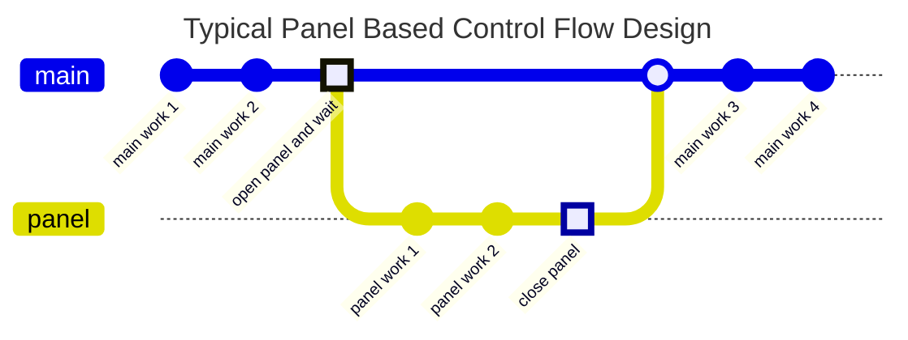
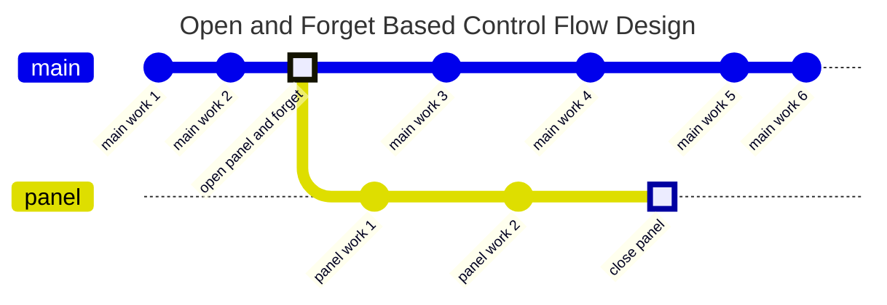
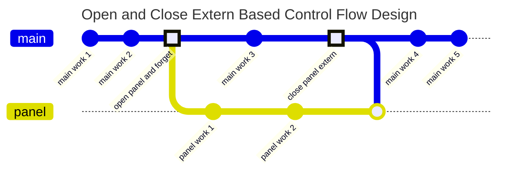
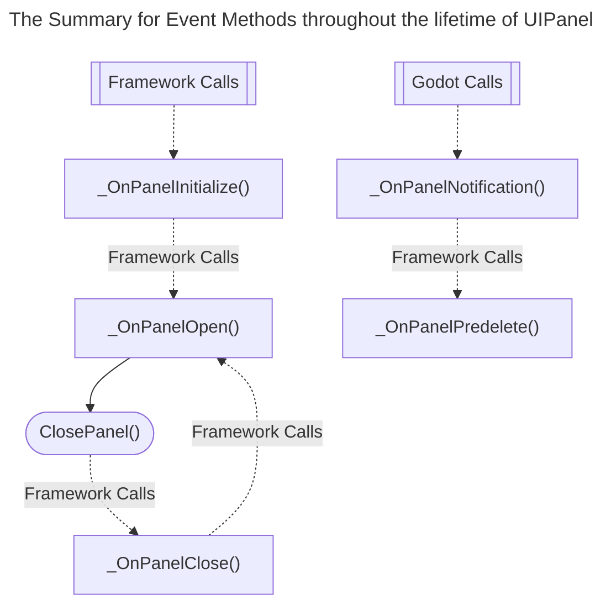

# GD Panel Framework [Work In Progress]

[](https://github.com/Delsin-Yu/GDPanelFramework/releases/Latest) [](https://www.nuget.org/packages/GDPanelFramework)  [](https://github.com/Delsin-Yu/GDPanelFramework/stargazers) [](https://github.com/Delsin-Yu/GDPanelFramework/blob/main/LICENSE)

## Introduction

Supports in `Godot 4.1+` with .Net module.
***GD Panel Framework*** is a `Godot 4` UI Management System designed to provide a `flexible`, `panel-based`, `single-focus point`, `Gamepad + Keyboard + Keyboard&Mouse friendly` UI programming experience.

This framework groups `sets` of `user interactions` into a `UIPanel`, which includes a combination of the following:

1. `Controls`, such as `button`, `label`, and `container`.
2. `Inputs`, which is a set of developer-defined input actions binds with this panel.

These `user interactions` are `panel-scoped`, which means they only stay active when the `panel` is active; this simplifies the workflow for maintaining large amounts of discrete `Controls` and `Global Input Actions` and allows developers to focus on programming game logic (*not collecting and toggling `Controls` or adding more `if`s into a global `_Input` method*).

---

<!-- START doctoc generated TOC please keep comment here to allow auto update -->
<!-- DON'T EDIT THIS SECTION, INSTEAD RE-RUN doctoc TO UPDATE -->
## Table of Contents

- [Simple API Usage](#simple-api-usage)
  - [Creating a simple panel](#creating-a-simple-panel)
  - [Creating a panel with Argument](#creating-a-panel-with-argument)
- [Framework Documentation](#framework-documentation)
  - [Panel Instantiation and Caching](#panel-instantiation-and-caching)
    - [Instantiate a Panel](#instantiate-a-panel)
    - [Framework-level Caching](#framework-level-caching)
  - [Framework Overview](#framework-overview)
    - [The Application Control Flow](#the-application-control-flow)
      - [Open and Wait for Closing](#open-and-wait-for-closing)
      - [Open and Forget](#open-and-forget)
      - [Open and Close Extern](#open-and-close-extern)
    - [Panel Event Methods Overview](#panel-event-methods-overview)
      - [Opening a panel](#opening-a-panel)
        - [Async/Wait Style](#asyncwait-style)
        - [Delegate/Callback Style](#delegatecallback-style)
        - [Forget Style](#forget-style)
      - [Configuring the Previous Panel Visual Behavior](#configuring-the-previous-panel-visual-behavior)
    - [The UIPanelArg](#the-uipanelarg)
    - [Panel Parent Container Management](#panel-parent-container-management)
    - [Input Binding / Routing](#input-binding--routing)
    - [Panel Tweener](#panel-tweener)
    - [AsyncInterop Class](#asyncinterop-class)
    - [Please Note when using this Framework](#please-note-when-using-this-framework)

<!-- END doctoc generated TOC please keep comment here to allow auto update -->

---

## Simple API Usage

### Creating a simple panel

You can run ***[RunMe_Example00.tscn](https://github.com/Delsin-Yu/GDPanelFramework.Test/blob/main/Examples/00/RunMe_Example00.tscn)*** in Godot Editor.

```csharp
using GDPanelFramework;
using Godot;
using GodotTask;

/// <summary>
/// The bootstrap script that creates and opens the panel.
/// </summary>
public partial class Example00_Main : Node
{
    /// <summary>
    /// The packed panel.
    /// </summary>
    [Export] private PackedScene _panelPrefab;

    /// <summary>
    /// Executes the main logic after one frame since the game starts. 
    /// This is required by the GDPanelFramework for adding its panel root into the scene tree.
    /// </summary>
    public override void _Ready() =>
        GDTask.NextFrame().ContinueWith(OnReady);

    private void OnReady()
    {
        _panelPrefab
            .CreatePanel<Example00_MyPanel>() // This extension method tells the framework to create or reuse an instance of this panel.
            .OpenPanel( // This method tells the framework to opens the panel.
                onPanelCloseCallback: // This delegate gets called when this panel gets closed when the panel itself calls ClosePanel().
                () => GetTree().Quit() // Terminate the application when this panel gets closed.
            );
    }
}
```

```csharp
// Main.cs
using GDPanelFramework.Panels;
using Godot;

/// <summary>
/// Attach this script to a Control to make it a "UIPanel".
/// </summary>
public partial class Example00_MyPanel : UIPanel
{
    // These three fields are assigned in Godot Editor, through inspector.
    [Export] private Label _text;
    [Export] private Button _updateButton;
    [Export] private Button _closeButton;

    // Stores the click count.
    private int _clickCount = 0;

    /// <summary>
    /// Called by the framework when this instance of panel is created,
    /// an instance can only gets created once.
    /// </summary>
    protected override void _OnPanelInitialize()
    {
        _updateButton.Pressed += OnClick; // Calls OnClick then the _updateButton gets pressed.
        _closeButton.Pressed += ClosePanel; // Close this panel when the _closeButton gets pressed.
    }

    /// <summary>
    /// Registered to the <see cref="_updateButton"/>.
    /// </summary>
    private void OnClick()
    {
        _clickCount++;
        _text.Text = $"Clicked {_clickCount} time(s).";
    }

    /// <summary>
    /// Called by the framework when this instance of panel is opened. 
    /// The framework supports automatic panel caching
    /// so a panel may gets opened multiple times after it's closed.
    /// </summary>
    protected override void _OnPanelOpen()
    {
        _text.Text = "Hello World";
        _updateButton.GrabFocus();
    }
}
```

### Creating a panel with Argument

> TODO

## Framework Documentation

### Panel Instantiation and Caching

#### Instantiate a Panel

Call `CreatePanel<TPanel>` to instatiate a panel from the supplied PackedScene, instead of the built-in `PackedScene.Instantiate`, this API also handles necessary initialization and caching.

```csharp
// In caller class.
[Export] private PackedScene _panelPrefab;

// In caller method.
var panelInstance = 
        _panelPrefab
            .CreatePanel<TypeOfScriptAttachedToThePanel>();
```

#### Framework-level Caching

In certain cases where a panel requires `frequent opening and closing by design` *(think about the inventory panel in some games)*, always instantiating a panel can be expensive. To resolve this hot spot issue, this framework does `automatically panel caching` that you can `configure on a per opening/closing basis`.

When creating a panel, by specifying the `createPolicy`, you may choose to force the framework `instantiate` a new instance of the panel (`CreatePolicy.ForceCreate`) or let the framework `reuse a cached instance (default)` if possible (`CreatePolicy.TryReuse`), of course, if there is no existing cache, a new instance is created anyway.

```csharp
// When creating a panel.
var panelInstance = 
        _panelPrefab
            .CreatePanel<TPanel>(
                createPolicy: CreatePolicy.ForceCreate // CreatePolicy.TryReuse
            );
```

When opening a panel, by specifying the `closePolicy`, you may choose to instruct the framework to `delete this instance` (`ClosePolicy.Delete`) after the transition completes or let the framework to `cache this instance (default)` (`ClosePolicy.Cache`), which you can reuse when the calling `CreatePanel` on the same `PackedScene` next time.

```csharp
// When opening a panel.
panelInstance
    .OpenPanel(
        closePolicy: ClosePolicy.Delete // ClosePolicy.Cache
    );

```

### Framework Overview

#### The Application Control Flow

In a typical GUI application such as Games, a `panel/page-based control flow` is a common practice. This framework embraces this practice by implementing the following `singular control flow-based` design.

##### Open and Wait for Closing

Think about an application that starts through a `Main` method, when opening a panel, you may `transfer the control flow` to that panel and do works in that panel, when done, close the panel from inside, and `return the control flow` back to the caller.



##### Open and Forget

There are cases where `the time of a panel closing is not a concern`. In the following example, you open a panel and `let that panel manage its own business (forget it)` and make it close itself when it finishes.



##### Open and Close Extern

There are also cases where you open the panel and, `close it from the caller when required`. In the following example, you `open a panel and close it from the caller (close extern)`.



This framework provides feature support for the above three practices.

#### Panel Event Methods Overview

While using the framework and `UIPanel`s certain methods get called at a certain lifetime of a panel, a brief diagram of the panel can be summarised as follows.



1. When calling `CreatePanel<TPanel>(PackedScene)` and causing a new instance of the creation, after the framework has done basic initializing, the `_OnPanelInitialize` method of that instance gets invoked. This method gets called only once throughout the panel lifetime; that means, if the `CreatePanel` has reused an instance of the panel, this method is not invoked again.
2. When calling any of the `OpenPanel` on a non-opened panel instance, after the framework has done preparations for opening this panel, the `_OnPanelOpen` method gets invoked. For a closed panel that gets cached, `_OnPanelOpen` will get re-invoked when the panel gets reopened.
3. When calling the `ClosePanel`, after the framework has done preparations for closing this panel, the `_OnPanelClose` method gets invoked. For a panel that gets cached, `_OnPanelClose` will get re-invoked when the panel gets reopened and closed.
4. A `UIPanel` delegates the `_Notification` engine call to `_OnPanelNotification`, and calls `_OnPanelPredelete` when necessary.

##### Opening a panel

There are three OpenPanel Methods for a UIPanel each of which is designed for a certain programming style.

###### Async/Wait Style

In an async method, this `async/await-styled` opening method returns a `one-time awaitable` that allows the developer to `await` for a panel close, in `PanelArg`, awaiting this awaitable will also get the return value from the panel.

```csharp
// When opening a panel, in async method.
await panelInstance.OpenPanelAsync();
GD.Print("The panel has closed!");
```

###### Delegate/Callback Style

This `callback-styled` opening method allows the developer to supply a delegate to get notified when the panel has closed, in `PanelArg`, the return value will also pass to this delegate.

```csharp
// When opening a panel.
panelInstance
    .OpenPanel(
        onPanelCloseCallback: // This lambda gets called when the panel is closed.
           () => GD.Print("The panel has closed!")
    );
```

###### Forget Style

This `forget-styled` opening method only opens the panel, it is useful when the time of a panel closing is not a concern.

```csharp
// When opening a panel.
panelInstance.OpenPanel();
```

##### Configuring the Previous Panel Visual Behavior

When opening a new panel, the currently active panel becomes `unavailable (such as buttons will no longer be clickable or focusable)`, you may also control whether the current panel should stay visible or hidden.

Setting the `previousPanelVisual` to `PreviousPanelVisual.Hidden` in `OpenPanel`, will instruct the framework to `hide the previous panel` using its `PanelTweener`, otherwise the panel will `stays visible (default)` (`PreviousPanelVisual.Visible`).

```csharp
// When opening a panel.
panelInstance
    .OpenPanel( // Any panel opening method.
        previousPanelVisual: PreviousPanelVisual.Hidden // PreviousPanelVisual.Visible
    );
```

#### The UIPanelArg

precautionsIt is a common practice for passing the argument to/receiving return value from a panel, `UIPanelArg<TOpenArg, TCloseArg>` is here to achieve this requirement.

```csharp
// MyArgumentPanel.cs
// Defines a panel that accepts an int as the opening argument, and string as the returning value.
public partial class MyArgumentPanel : UIPanelArg<int, string>
{
    protected override void _OnPanelOpen(int openArg) // The opening argument passed from the caller.
    {
        GD.Print($"Opened with argument: {openArg}");
        ClosePanel(openArg.ToString()); // The ClosePanel method requires a return value.
    }
}
```

Different from the regular `UIPanel` type, the `OpenPanel` methods of a `UIPanelArg` accepts an extra argument and passes it to the `_OnPanelOpen(TOpenArg)` panel event method and its async/callback-styled overload has its way for obtaining the return value.

```csharp
// In caller class.
[Export] private PackedScene _panelPrefab;

// In caller method.
var argPanelInstance = _panelPrefab.CreatePanel<MyArgumentPanel>();

// Async/Await-styled open method.
string returnValue = await argPanelInstance.OpenPanelAsync(10); // return value is "10".

// Callback/Delegate-styled open method.
argPanelInstance.OpenPanel(10, onPanelCloseCallback: value => GD.Print(value == "10")) // prints true when the panel closes.
```

The `UIPanelArg` supports both `passing an argument` and `returning a value`, if one of the features is not needed, you may use the `Empty` struct to serve as a placeholder.

```csharp
// The definition for a panel that does't requires opening argument.
public partial class MyArgumentPanel : UIPanelArg<Empty, string>
{
    protected override void _OnPanelOpen(Empty _)
    {
        ClosePanel("Hello World!");
    }
}

// In caller method
argPanelInstance.OpenPanelAsync(Empty.Default);
```

```csharp
// The definition for a panel that doesn't requires returning value.
public partial class MyArgumentPanel : UIPanelArg<int, Empty>
{
    protected override void _OnPanelOpen(int openArg)
    {
        GD.Print($"Opened with argument: {openArg}");
        ClosePanel(Empty.Default);
    }
}
```

#### Panel Parent Container Management

> WIP: Introduction to configuring the parent container for the opening panels  
> WIP: The `RootPanelContainer` Node  
> WIP: The `PushPanelParent` Method  
> WIP: The `PopPanelParent` Method  

#### Input Binding / Routing

> WIP: Introduction to the framework level Input Routing  
> WIP: The `RegisterInput` Method  
> WIP: The `RemoveInput` Method  
> WIP: The `GodotBuiltinActionNames` Static Class  
> WIP: The `PanelManager.UICancelActionName` Property  
> WIP: The `RegisterCancelInput` Method  
> WIP: The `RemoveCancelInput` Method  
> WIP: The `EnableCloseWithCancelKey` Method  
> WIP: The `DisableCloseWithCancelKey` Method  

#### Panel Tweener

> WIP: Introduction to the `PanelTweener` and `IPanelTweener` interface  
> WIP: The `PanelManager.IPanelTweener` Property  
> WIP: The `IPanelTweener` Property in Panel  
> WIP: The Built-in `NonePanelTweener`  
> WIP: The Built-in `FadePanelTweener`  

#### AsyncInterop Class

> WIP: Introduction to converting a `delegate/callback` style api into `async/await` style api  

#### Please Note when using this Framework

While there are precautions taken in order to prevent framework crashes, there are still certain

The following panel event methods are execute in under `try ... catch bloack`, throwing exceptions in the overrides of these methods will not crash the framework.

- `_OnPanelInitialize`
- `_OnPanelOpen`
- `_OnPanelClose`
- `_OnPanelPredelete`
- `_OnPanelNotification`
- Registered input events

The following usage ***WILL*** crash the framework:

- Openning a panel that's not initialized, which probably means the instance of this panel is not obtained through `CreatePanel` API.
- Openning a panel that's already opened.
- Closing a panel that's not the last opened panel.
