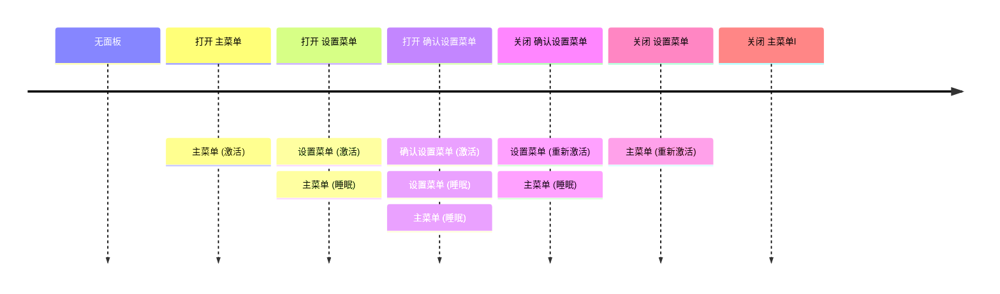
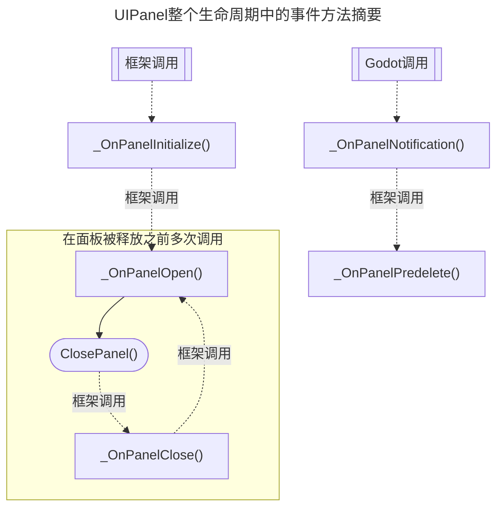

# GD Panel Framework

[English](https://github.com/Delsin-Yu/GDPanelFramework/blob/main/README.md)

[](https://github.com/Delsin-Yu/GDPanelFramework/releases/latest) [](https://www.nuget.org/packages/GDPanelFramework)  [](https://github.com/Delsin-Yu/GDPanelFramework/stargazers) [](https://github.com/Delsin-Yu/GDPanelFramework/blob/main/LICENSE)

## 引言

支持包括`.Net 模块`的`Godot 4.1+`
***GD Panel Framework*** is a `Godot 4` UI Management System designed to provide a `flexible`, `panel-based`, `single-focus point`, `Gamepad + Keyboard + Keyboard&Mouse friendly` UI programming experience.
***GD Panel Framework***是为`Godot 4`设计的UI管理系统，旨在提供灵活、基于面板、单焦点、多输入设备兼容的UI编程体验。

该框架将`用户交互`的集合总结为`UIPanel`，其中包括以下内容的组合：

1. `控件`，如`按钮`、`标签`和`容器`。
2. `输入`，一组开发人员定义的，与该面板绑定的输入操作。

这些`用户交互`是`面板范围的`，这意味着它们只有在`面板`处于活动状态时才保持活动状态；这简化了维护大量离散`控件`和`全局输入动作`的工作量，并允许开发人员专注于编程游戏逻辑（*而不是收集和开关`控件`或将更多`if`添加到全局`_Input`方法中*）。

## 安装

使用 .Net 控制台

```txt
dotnet add package GDPanelFramework
```

使用 Package Manager 控制台

```txt
NuGet\Install-Package GDPanelFramework
```

在 `csproj` 添加PackageReference

```xml
<PackageReference Include="GDPanelFramework" Version="*" />
```

---

<!-- START doctoc generated TOC please keep comment here to allow auto update -->
<!-- DON'T EDIT THIS SECTION, INSTEAD RE-RUN doctoc TO UPDATE -->
## Table of Contents

- [API简单用法](#api%E7%AE%80%E5%8D%95%E7%94%A8%E6%B3%95)
  - [创建一个简单的面板](#%E5%88%9B%E5%BB%BA%E4%B8%80%E4%B8%AA%E7%AE%80%E5%8D%95%E7%9A%84%E9%9D%A2%E6%9D%BF)
  - [创建一个支持传参及返回值的面板](#%E5%88%9B%E5%BB%BA%E4%B8%80%E4%B8%AA%E6%94%AF%E6%8C%81%E4%BC%A0%E5%8F%82%E5%8F%8A%E8%BF%94%E5%9B%9E%E5%80%BC%E7%9A%84%E9%9D%A2%E6%9D%BF)
- [框架文档](#%E6%A1%86%E6%9E%B6%E6%96%87%E6%A1%A3)
  - [框架概念](#%E6%A1%86%E6%9E%B6%E6%A6%82%E5%BF%B5)
  - [`UIPanel` 类型](#uipanel-%E7%B1%BB%E5%9E%8B)
    - [实例化一个面板](#%E5%AE%9E%E4%BE%8B%E5%8C%96%E4%B8%80%E4%B8%AA%E9%9D%A2%E6%9D%BF)
    - [开启一个面板](#%E5%BC%80%E5%90%AF%E4%B8%80%E4%B8%AA%E9%9D%A2%E6%9D%BF)
    - [关闭一个面板](#%E5%85%B3%E9%97%AD%E4%B8%80%E4%B8%AA%E9%9D%A2%E6%9D%BF)
    - [输入绑定/路由](#%E8%BE%93%E5%85%A5%E7%BB%91%E5%AE%9A%E8%B7%AF%E7%94%B1)
      - [输入注册](#%E8%BE%93%E5%85%A5%E6%B3%A8%E5%86%8C)
        - [基本用法](#%E5%9F%BA%E6%9C%AC%E7%94%A8%E6%B3%95)
        - [变体: `RegisterInputCancel`/`RemoveInputCancel`/`ToggleInputCancel`](#%E5%8F%98%E4%BD%93-registerinputcancelremoveinputcanceltoggleinputcancel)
        - [变体: `EnableCloseWithCancelKey` and `DisableCloseWithCancelKey`](#%E5%8F%98%E4%BD%93-enableclosewithcancelkey-and-disableclosewithcancelkey)
        - [变体: `RegisterInputAxis`/`RemoveInputAxis`/`ToggleInputAxis`](#%E5%8F%98%E4%BD%93-registerinputaxisremoveinputaxistoggleinputaxis)
        - [变体: `RegisterInputVector`/`RemoveInputVector`/`ToggleInputVector`](#%E5%8F%98%E4%BD%93-registerinputvectorremoveinputvectortoggleinputvector)
      - [BuiltinInputNames类](#builtininputnames%E7%B1%BB)
    - [面板栈/Panel Stack](#%E9%9D%A2%E6%9D%BF%E6%A0%88panel-stack)
    - [框架级别缓存](#%E6%A1%86%E6%9E%B6%E7%BA%A7%E5%88%AB%E7%BC%93%E5%AD%98)
    - [面板事件方法概述](#%E9%9D%A2%E6%9D%BF%E4%BA%8B%E4%BB%B6%E6%96%B9%E6%B3%95%E6%A6%82%E8%BF%B0)
    - [配置上一个面板的视觉行为](#%E9%85%8D%E7%BD%AE%E4%B8%8A%E4%B8%80%E4%B8%AA%E9%9D%A2%E6%9D%BF%E7%9A%84%E8%A7%86%E8%A7%89%E8%A1%8C%E4%B8%BA)
  - [`UIPanelArg` 类型](#uipanelarg-%E7%B1%BB%E5%9E%8B)
  - [面板容器管理](#%E9%9D%A2%E6%9D%BF%E5%AE%B9%E5%99%A8%E7%AE%A1%E7%90%86)
  - [`面板过渡控制器/PanelTweener`](#%E9%9D%A2%E6%9D%BF%E8%BF%87%E6%B8%A1%E6%8E%A7%E5%88%B6%E5%99%A8paneltweener)
    - [内置过渡器](#%E5%86%85%E7%BD%AE%E8%BF%87%E6%B8%A1%E5%99%A8)
    - [自定义过渡器](#%E8%87%AA%E5%AE%9A%E4%B9%89%E8%BF%87%E6%B8%A1%E5%99%A8)
  - [使用`async/await`风格的API时请注意](#%E4%BD%BF%E7%94%A8asyncawait%E9%A3%8E%E6%A0%BC%E7%9A%84api%E6%97%B6%E8%AF%B7%E6%B3%A8%E6%84%8F)
  - [使用此框架时请注意](#%E4%BD%BF%E7%94%A8%E6%AD%A4%E6%A1%86%E6%9E%B6%E6%97%B6%E8%AF%B7%E6%B3%A8%E6%84%8F)

<!-- END doctoc generated TOC please keep comment here to allow auto update -->

---

## API简单用法

### 创建一个简单的面板

你可以在Godot编辑器中运行 ***[RunMe_Example00.tscn](https://github.com/Delsin-Yu/GDPanelFramework.Test/blob/main/Examples/00/RunMe_Example00.tscn)***。

```csharp
using Godot;
using GodotTask;

namespace GDPanelFramework.Examples;

/// <summary>
/// 创建并打开面板的引导程序脚本。
/// </summary>
public partial class Example00_Main : Node
{
    /// <summary>
    /// 以PackedScene引用的面板Prefab
    /// </summary>
    [Export] private PackedScene _panelPrefab;

    /// <summary>
    /// 自游戏开始一帧后执行主逻辑。
    /// 这是框架将其面板根添加到场景树中所必需的。
    /// </summary>
    public override void _Ready() =>
        GDTask.NextFrame().ContinueWith(OnReady);

    private void OnReady()
    {
        _panelPrefab
            .CreatePanel<Example00_MyPanel>() // 这个扩展方法告诉框架创建或重用这个面板的实例。
            .OpenPanel( // 这个方法告诉框架打开面板。
                onPanelCloseCallback: // 当面板本身调用ClosePanel()时，当该面板关闭时，会调用此委托。
                () => GetTree().Quit() // 关闭此面板后终止应用程序。
            );
    }
}
```

```csharp
using GDPanelFramework.Panels;
using Godot;

namespace GDPanelFramework.Examples;

/// <summary>
/// 将此脚本附加到控件以使其成为“UIPanel”。
/// </summary>
public partial class Example00_MyPanel : UIPanel
{
    // 这三个字段是在Godot编辑器中通过 inspector 分配的。
    [Export] private Label _text;
    [Export] private Button _updateButton;
    [Export] private Button _closeButton;

    // 存储单击次数。
    private int _clickCount = 0;

    /// <summary>
    /// 当创建该面板实例时由框架调用，
    /// 一个实例只能被创建一次。
    /// </summary>
    protected override void _OnPanelInitialize()
    {
        _updateButton.Pressed += OnClick; // 当_updateButton被按下时调用OnClick。
        _closeButton.Pressed += ClosePanel; // 当_closeButton被按下时关闭当前面板。
    }

    /// <summary>
    /// 被注册到<see cref="_updateButton"/>中.
    /// </summary>
    private void OnClick()
    {
        _clickCount++;
        _text.Text = $"Clicked {_clickCount} time(s).";
    }

    /// <summary>
    /// 当面板的此实例打开时由框架调用。
    /// 该框架支持自动面板缓存，因此，你可以在一个面板的实例被关闭并缓存后重新打开它。
    /// </summary>
    protected override void _OnPanelOpen()
    {
        _text.Text = "Hello World";
        _updateButton.GrabFocus();
    }
}
```

### 创建一个支持传参及返回值的面板

你可以在Godot编辑器中运行 ***[RunMe_Example01.tscn](https://github.com/Delsin-Yu/GDPanelFramework.Test/blob/main/Examples/01/RunMe_Example01.tscn)***。

```csharp
using Godot;
using GodotTask;

namespace GDPanelFramework.Examples;

/// <summary>
/// 创建并打开面板的引导程序脚本。
/// </summary>
public partial class Example01_Main : Node
{
    /// <summary>
    /// 以PackedScene引用的面板Prefab
    /// </summary>
    [Export] private PackedScene _panelPrefab;

    /// <summary>
    /// 自游戏开始一帧后执行主逻辑。
    /// 这是框架将其面板根添加到场景树中所必需的。
    /// </summary>
    public override void _Ready() =>
        GDTask.NextFrame().ContinueWith(OnReady);

    private void OnReady()
    {
        _panelPrefab
            .CreatePanel<Example01_MyPanel>() // 这个扩展方法告诉框架创建或重用这个面板的实例。
            .OpenPanel( // // 这个方法告诉框架打开面板。
                "Hello World!", // 将参数传递给面板。
                onPanelCloseCallback: // 当面板本身调用ClosePanel()时，当该面板关闭时，会调用此委托。
                result => // 在此面板关闭时打印返回值，并终止应用程序。
                {
                    GD.Print($"Clicked {result} time(s) before closed.");
                    GetTree().Quit();
                }
            );
    }
}
```

```csharp
using GDPanelFramework.Panels;
using Godot;

namespace GDPanelFramework.Examples;

/// <summary>
/// 将此脚本附加到控件以使其成为“UIPanelArg”。
/// </summary>
public partial class Example01_MyPanel : UIPanelArg<string, string>
{
    // 这三个字段是在Godot编辑器中通过 inspector 分配的。
    [Export] private Label _text;
    [Export] private Button _updateButton;
    [Export] private Button _closeButton;

    // 存储单击次数。
    private int _clickCount = 0;

    /// <summary>
    /// 当创建该面板实例时由框架调用，
    /// 一个实例只能被创建一次。
    /// </summary>
    protected override void _OnPanelInitialize()
    {
        _updateButton.Pressed += OnClick; // 当_updateButton被按下时调用OnClick。
        _closeButton.Pressed += () => ClosePanel(_clickCount.ToString()); // 当_closeButton被按下时关闭当前面板。
    }

    /// <summary>
    /// 被注册到<see cref="_updateButton"/>中.
    /// </summary>
    private void OnClick()
    {
        _clickCount++;
        _text.Text = $"Clicked {_clickCount} time(s).";
    }

    /// <summary>
    /// 当面板的此实例打开时由框架调用。
    /// 该框架支持自动面板缓存，因此，你可以在一个面板的实例被关闭并缓存后重新打开它。
    /// </summary>
    protected override void _OnPanelOpen(string openArg)
    {
        _text.Text = openArg;
        _updateButton.GrabFocus();
    }
}
```

## 框架文档

### 框架概念

在诸如游戏之类的典型GUI应用程序中，`基于面板/页面的控制流`是一种常见的做法。

当从`主逻辑`打开面板时，开发人员可能希望面板执行其自己的`面板逻辑`，并在完成时`自动关闭`，然后继续执行`主要逻辑`（如文件对话框或警告）。

这种设计`将控制流从主逻辑转移到面板，完成后面板将控制流返回主逻辑`简化了面板编程的工作流程，处理了管理ui焦点的要求，在设计与游戏板兼容的游戏时至关重要。

该框架通过`基于面板堆栈的控制管理`、`异步/回调样式的API`和`面板输入绑定`设计来实现此实践。

### `UIPanel` 类型

`UIPanel/面板`是该框架的基本组件，它为简化编程工作流程提供了`面板级输入绑定`、`子控件访问管理`功能，还支持可配置的`面板过渡控制器`，用于界面打开/关闭的动态美术需求。

- `面板级输入绑定`功能允许开发人员为此面板注册/取消注册一组输入绑定，注册的输入在面板级被隔离开，这样当面板处于非活动状态时，它们就不会影响到其他逻辑。

- 当面板激活/停用时，`子控件访问管理`功能会自动禁用/恢复每个子控件的`FocusMode`和`MouseFilter`属性，从而防止不需要的UI导航和鼠标交互“泄漏到”当前激活的面板之外。

#### 实例化一个面板

通过调用`CreatePanel<TPanel>`以从给定的PackedScene实例化一个界面，和内置的`PackedScene.Instantiate`相比，此API会使用缓存，并且处理必要的界面初始化操作。

```csharp
// 在调用类中。
[Export] private PackedScene _panelPrefab;

// 在方法中。
var panelInstance = 
        _panelPrefab
            .CreatePanel<TypeOfScriptAttachedToThePanel>();
```

#### 开启一个面板

UIPanel有三种OpenPanel方法，每种方法都是为特定的编程风格设计的。

在异步方法中，`async/await样式`的打开方法返回一个`一次性awaitable`，允许开发人员`等待`面板关闭，在`PanelArg`中，等待该awaitable也将从面板获得返回值。

```csharp
// 在异步方法中开启面板时。
await panelInstance.OpenPanelAsync();
GD.Print("The panel has closed!");
```

`回调风格`的打开方法允许开发人员提供一个委托，以便在面板关闭时得到通知，在`PanelArg`中，返回值也将传递给该委托。

```csharp
// 开启面板时。
panelInstance
    .OpenPanel(
        onPanelCloseCallback: // 该lambda表达式在面板关闭时被调用。
           () => GD.Print("The panel has closed!")
    );
```

`遗忘风格`的打开方法只打开面板，当面板关闭的时机不重要时，它很有用。

```csharp
// 开启面板时。
panelInstance.OpenPanel();
```

#### 关闭一个面板

在面板脚本中调用`ClosePanel()`将关闭打开的面板。默认情况下，此方法是`protected`，开发人员可以通过用公共方法包装此方法来提升可见性。

> 请注意，在关闭面板之前，必须先打开面板；此外，关闭不在面板堆栈顶部的面板被认为是一个错误，会使框架崩溃。

```csharp
// 在面板脚本中
protected override void _OnPanelOpen()
{
    // 在面板打开一帧后关闭面板。
    GDTask.NextFrame().ContinueWith(ClosePanel);
}
```

#### 输入绑定/路由

所有Godot输入事件都被`root/RootPanelViewport`截获，并直接分派到当前活动的面板。当面板`停用/激活`时，绑定到面板的一组输入会被`自动关闭或打开`。

##### 输入注册

###### 基本用法

在面板中调用`RegisterInput`可以将委托绑定到特定的输入事件，当面板释放时，已注册的委托将自动释放。

```csharp
// 在面板中
RegisterInput( // 向关联的inputName注册回调
    BuiltinInputNames.UIAccept, // 要关联的输入名称，此名称应与InputManager中的名称相对应。
    inputEvent => GD.Print(inputEvent.AsText()), // 要被关联的委托。
    InputActionPhase.Pressed // 要关注的输入状态。
);
```

在某些需要解除委托绑定的情况下，开发者应调用`RemoveInput`并传入对应的注册信息。

> 请注意，在处理输入注销时，如果要正确注销`lambda表达式`，则必须在注册时`将lambda表达式分配给变量`并且`将该变量传递给API`。

```csharp
// 将此lambda表达式赋给变量。
Action<InputEvent> myDelegate = inputEvent => GD.Print(inputEvent.AsText());

// 将此回调注册到关联的inputName。
RegisterInput(BuiltinInputNames.UIAccept, myDelegate);
// 使用同样的信息来注销。
RemoveInput(BuiltinInputNames.UIAccept, myDelegate);
```

或者，您可以使用`ToggleInput`API。

```csharp
ToggleInput( // 这个api支持基于第一个bool参数的值在注册和注销之间切换。
    true, // 如设置为false的话就执行注销。
    BuiltinInputNames.UIAccept,
    inputEvent => GD.Print(inputEvent.AsText()) // 此lambda表达式由编译器缓存。
);
```

为了实现某些目的，输入注册API还有其他几种变体。

###### 变体: `RegisterInputCancel`/`RemoveInputCancel`/`ToggleInputCancel`

将委托直接与`ui_cancel`输入事件关联，开发人员可以通过修改`PanelManager.UICancelActionName`来变更这个值。

```csharp
RegisterInputCancel(() => GD.Print("Canceled!"));

Action myDelegate = () => GD.Print("Canceled!");
RegisterInputCancel(myDelegate);
RemoveInputCancel(myDelegate);

ToggleInputCancel(true, () => GD.Print("Canceled!"));
```

###### 变体: `EnableCloseWithCancelKey` and `DisableCloseWithCancelKey`

`UIPanel`附带了两个额外的输入绑定API：`EnableCloseWithCancelKey`和`DisableCloseWithCancelKey`，调用`EnableCloseWithCancelKey`允许玩家使用`ui_cancel`（`PanelManager.UICancelActionName`）关闭当前面板，调用`DisableCloseWithCancelKey`会取消此行为。

###### 变体: `RegisterInputAxis`/`RemoveInputAxis`/`ToggleInputAxis`

将委托与两个输入的组合相关联，类似于`Input.GetAxis`的行为。

```csharp
RegisterInputAxis(
    BuiltinInputNames.UILeft,
    BuiltinInputNames.UIRight,
    value => GD.Print(value),
    CompositeInputActionState.Update // Start, End
);

Action<float> myDelegate = value => GD.Print(value);
RegisterInputAxis(
    BuiltinInputNames.UILeft,
    BuiltinInputNames.UIRight,
    myDelegate,
    CompositeInputActionState.Update
);
RemoveInputAxis(
    BuiltinInputNames.UILeft,
    BuiltinInputNames.UIRight,
    myDelegate,
    CompositeInputActionState.Update
);

ToggleInputAxis(
    true,
    BuiltinInputNames.UILeft,
    BuiltinInputNames.UIRight,
    value => GD.Print(value),
    CompositeInputActionState.Update
);
```

###### 变体: `RegisterInputVector`/`RemoveInputVector`/`ToggleInputVector`

将委托与四个输入的组合相关联，类似于`Input.GetVector`的行为。

```csharp
RegisterInputVector(
    BuiltinInputNames.UIUp,
    BuiltinInputNames.UIDown,
    BuiltinInputNames.UILeft,
    BuiltinInputNames.UIRight,
    value => GD.Print(value),
    CompositeInputActionState.Update // Start, End
);

Action<Vector2> myDelegate = value => GD.Print(value);
RegisterInputVector(
    BuiltinInputNames.UIUp,
    BuiltinInputNames.UIDown,
    BuiltinInputNames.UILeft,
    BuiltinInputNames.UIRight,
    myDelegate,
    CompositeInputActionState.Update
);
RemoveInputVector(
    BuiltinInputNames.UIUp,
    BuiltinInputNames.UIDown,
    BuiltinInputNames.UILeft,
    BuiltinInputNames.UIRight,
    myDelegate,
    CompositeInputActionState.Update
);

ToggleInputVector(
    true,
    BuiltinInputNames.UIUp,
    BuiltinInputNames.UIDown,
    BuiltinInputNames.UILeft,
    BuiltinInputNames.UIRight,
    value => GD.Print(value),
    CompositeInputActionState.Update
);
```

##### BuiltinInputNames类

Godot提供了一个列表的内置ui输入事件，开发人员可以从`BuiltinInputNames`类访问这些输入事件的名称。

#### 面板栈/Panel Stack

`面板栈/Panel Stack`用于维护打开的面板的顺序，当打开面板时，框架会检视顶部面板的面板堆栈，禁用其下的每个控件（并缓存它们之前的打开状态），并将此新实例推送到堆栈。当关闭顶部面板时，框架将其从面板堆栈中弹出，并重新激活其下方面板的所有控件，它还将焦点恢复为该面板变为非活动状态之前的最后一个选定的项目。

以下示例显示了以下操作一系列操作时面板栈的状态：



#### 框架级别缓存

在某些情况下，面板在设计中就需要`频繁打开和关闭`*（例如某些游戏中的库存面板）*，在这种情况下，每次实例化面板并在关闭时删除它可能会带来较高负担。为了解决这个性能问题，该框架会`自动缓存面板`，您可以`在每次打开/关闭界面时进行配置`。

When creating a panel, by specifying the `createPolicy`, you may choose to force the framework `instantiate` a new instance of the panel (`CreatePolicy.ForceCreate`) or let the framework `reuse a cached instance (default)` if possible (`CreatePolicy.TryReuse`), of course, if there is no existing cache, a new instance is created anyway.

在创建面板时，通过指定`createPolicy`，您可以选择强制框架`创建面板的新实例`（`createPolicy.ForceCreate`），或者让框架尽可能`重用缓存的实例（默认值）`（`createPolicy.TryReuse`”`），当然，如果没有现有缓存，无论如何都会创建一个新实例。

```csharp
// 在创建面板时
var panelInstance = 
        _panelPrefab
            .CreatePanel<TPanel>(
                createPolicy: CreatePolicy.ForceCreate // CreatePolicy.TryReuse
            );
```

打开面板时，通过指定`closePolicy`，您可以选择指示框架在关闭的过渡动画完成后`删除此实例`（`closePolicy.delete`），或者让框架`缓存此实例（默认值）`（`closePolicy.cache`），并且下次在同一`PackedScene`上调用`CreatePanel`时重复使用。

```csharp
// 在开启面板时
panelInstance
    .OpenPanel(
        closePolicy: ClosePolicy.Delete // ClosePolicy.Cache
    );

```

#### 面板事件方法概述

在使用`UIPanel`时，某些方法会在面板的特定生存期内被框架调用，简要示意图可以总结如下。



1. 当调用`CreatePanel<TPanel>(PackedScene)`并导致新实例被创建时，在框架完成基本初始化后，会调用该实例的`_OnPanelInitialize`方法。在整个面板生命周期中，此方法只被调用一次；这意味着，如果`CreatePanel`重用了面板的实例，则不会再次调用此方法。
2. 当在未打开的面板实例上调用任何`OpenPanel`时，在框架完成打开此面板的准备工作后，将调用`_OnPanelOpen`方法。对于缓存的已关闭面板，当面板重新打开时，将再次调用`_OnPanelOpen`。
3. 当调用`ClosePanel`时，在框架完成关闭此面板的准备工作后，将调用`_OnPanelClose`方法。对于缓存的面板，当面板重新打开和关闭时，将再次调用`_OnPanelClose`。
4. `UIPanel`将`_Notification`引擎事件委托给`_OnPanelNotification`，并在必要时调用`_OnPanelPredelete`。

#### 配置上一个面板的视觉行为

打开新面板时，当前活动面板将变为`不可用（例如按钮将不再可点击或可聚焦）`，您还可以控制当前面板是保持可见还是隐藏。

在`OpenPanel`中将`previousPanelVisual`设置为`PreviousPanelVisual.Hidden`，将指示框架使用`上一个面板`的`PanelTweener`隐藏自身，否则上一个面板将`保持可见（默认）`（`PreviousPanelVisual.Visible`）。

```csharp
// 打开面板时。
panelInstance
    .OpenPanel( // 任何面板打开方法。
        previousPanelVisual: PreviousPanelVisual.Hidden // PreviousPanelVisual.Visible
    );
```

### `UIPanelArg` 类型

将参数传递给面板/从面板接收返回值是一种常见的做法，`UIPanelArg<TOpenArg, TCloseArg>`就是为了实现这一要求。

```csharp
// MyArgumentPanel.cs
// 定义一个面板，该面板接受int作为开始参数，并使用string作为返回值。
public partial class MyArgumentPanel : UIPanelArg<int, string>
{
    protected override void _OnPanelOpen(int openArg) // 从调用方传递的开启参数。
    {
        GD.Print($"Opened with argument: {openArg}");
        ClosePanel(openArg.ToString()); // ClosePanel方法需要提供一个返回值。
    }
}
```

常规的`UIPanel`类型不同，`UIPanelArg`的`OpenPanel`方法接受一个额外的参数，并将其传递给`_OnPanelOpen(TOpenArg)`面板事件方法，其异步/回调风格的重载也有获得返回值的方法。

```csharp
// 在调用类中。
[Export] private PackedScene _panelPrefab;

// 在调用方法中。
var argPanelInstance = _panelPrefab.CreatePanel<MyArgumentPanel>();

//异步/Await风格的开启方法。
string returnValue = await argPanelInstance.OpenPanelAsync(10); // returnValue为字符串的“10”。

// 回调/委托风格的开启方法。
argPanelInstance.OpenPanel(10, onPanelCloseCallback: value => GD.Print(value == "10")) // 面板关闭时打印true。
```

`UIPanelArg`同时支持`传递开启参数`和`返回值`，如果不需要其中一个功能，则可以使用`Empty`结构体作为占位符。

```csharp
// 定义一个不需要开启参数的界面（仅返回值）
public partial class MyArgumentPanel : UIPanelArg<Empty, string>
{
    protected override void _OnPanelOpen(Empty _)
    {
        ClosePanel("Hello World!");
    }
}

// 在调用方法中。
argPanelInstance.OpenPanelAsync(Empty.Default);
```

```csharp
// 定义一个不需要返回值的界面（仅传递开启参数）
public partial class MyArgumentPanel : UIPanelArg<int, Empty>
{
    protected override void _OnPanelOpen(int openArg)
    {
        GD.Print($"Opened with argument: {openArg}");
        ClosePanel(Empty.Default);
    }
}
```

### 面板容器管理

默认情况下，所有面板都在`root/RootPanelViewport/PanelRoot`下实例化，开发人员可以通过一系列API为打开的面板配置容器。

与`面板栈`类似，`面板容器栈`是为管理`面板容器`而设计的，开发人员可以使用`PanelManager.PushPanelContainer`将控件推送到面板容器堆栈，然后通过`PanelManager.PopPanelContainer`。与打开和关闭面板的限制相同，开发人员只允许弹出最上面的容器，然后才能弹出其他容器。

为了防止意外弹出容器，每个`PushPanelContainer`操作都由一个节点`授权`，也就是说，当推送新容器时，您需要提供一个`键`，并使用相同的`键`弹出容器。

```csharp
// 在调用类中。
[Export] private Control _myContainer;

// 在方法中。

// 此行之后的每个打开的面板都将实例化在/被移动到_myContainer下。
PanelManager.PushPanelContainer(this, _myContainer);

// 此行之后的每个打开的面板都将实例化在/被移动到默认容器下。
PanelManager.PopPanelContainer(this);
```

> 请注意，在使用自定义面板容器时，当`在将来会被删除的面板/自定义容器下生成面板`时要小心，虽然框架会尽力处理已删除的面板，但部分操作还是会无法避免的`删除具有活动面板的自定义面板容器`，这种行为可能会使框架崩溃，建议开发人员在弹出/删除该容器之前先确保自定义容器下的每个面板都已关闭。

### `面板过渡控制器/PanelTweener`

开发人员可以通过设置面板的`PanelTweener`属性来自定义面板的`打开/关闭时的视觉过渡行为`。或者，也可以通过修改`PanelManager.DefaultPanelTweener`来为全局所有面板设置默认的过渡器。

#### 内置过渡器

该框架提供了两个预配置的过渡器。

1. NonePanelTweener: 此过渡器在打开和关闭时立即隐藏和显示面板，它也是`PanelManager.DefaultPanelTweener`的默认值，您可以从`NonPanelTweener`访问它的全局实例。
2. FadePanelTweener: 此过渡器为面板打开和关闭执行透明度渐变过渡，在实例化之后，您可以通过访问其`FadeTime`属性来配置转换时间。

#### 自定义过渡器

开发者可以通过继承`IPanelTweenr`接口来自定义它们的转换效果。

```csharp
/// <summary>
/// 定义面板过渡的行为。
/// </summary>
public interface IPanelTweener
{
    /// <summary>
    /// 这将设置面板的默认视觉外观。
    /// </summary>
    /// <param name="panel">目标面板。</param>
    void Init(Control panel);
    
    /// <summary>
    /// 这个异步方法管理面板显示时的行为。
    /// </summary>
    /// <param name="panel">目标面板。</param>
    /// <param name="onFinish">当行为被认为完成时由方法调用，或者当行为被中断时根本不调用</param>
    void Show(Control panel, Action? onFinish);
    
    /// <summary>
    /// 这个异步方法管理面板隐藏时的行为。
    /// </summary>
    /// <param name="panel">目标面板。</param>
    /// <param name="onFinish">当行为被认为完成时由方法调用，或者当行为被中断时根本不调用</param>
    void Hide(Control panel, Action? onFinish);
}
```

### 使用`async/await`风格的API时请注意

框架中的大多数异步方法都是以`回调/委托`风格编写的，也就是说，它们的方法签名中有一个`Action onFinish`参数。

为了提供`async/await`风格的编程体验，`AsyncInterop`实用程序类被用于将`回调/委托`风格的API转换为`async/await`样式的API。

返回的`AsyncAwaitable`可以与`await`关键字一起使用，类似于ValueTask，开发人员只能对该值执行一次等待。

```csharp
public void CallbackStyledMethod(Action onFinish);

public AsyncAwaitable AsyncAwaitStyledMethodAsync()
{
    return AsyncInterop.ToAsync(CallbackStyledMethod);
}

public void CallbackStyledMethodWithReturn(Action<int> onFinish);

public AsyncAwaitable<int> AsyncAwaitStyledMethodWithReturnAsync()
{
    return AsyncInterop.ToAsync<int>(CallbackStyledMethodWithReturn);
}
```

### 使用此框架时请注意

尽管我们已经采取了相应的预防措施，但仍有一些情况下，API的某些使用可能会不可避免地导致框架崩溃。

以下面板事件方法在`try ... catch 块`中执行，在这些方法的重写中抛出异常不会使框架崩溃。

- `_OnPanelInitialize`
- `_OnPanelOpen`
- `_OnPanelClose`
- `_OnPanelPredelete`
- `_OnPanelNotification`
- 已注册的输入事件

以下用法 ***将会*** 导致框架崩溃：

- 通过指定不等于`脚本类型`的类型来创建面板。
- 打开一个未初始化的面板，通常代表该面板的实例不是通过`CreatePanel`API获取的。
- 打开一个已经开启的面板
- 关闭一个不是最后一次打开的面板的面板。
- 提供了无效的“CompositeInputActionState”枚举。
- 使用错误的`节点`来弹出被`另一个节点`推送的`面板容器`。
- 对一个已经使用过`await`关键字的`AsyncAwaitable`再次使用`await`关键字，或访问其的任何参数。
- 对尚未完成的`AsyncAwaitable`调用`GetResult()`。
